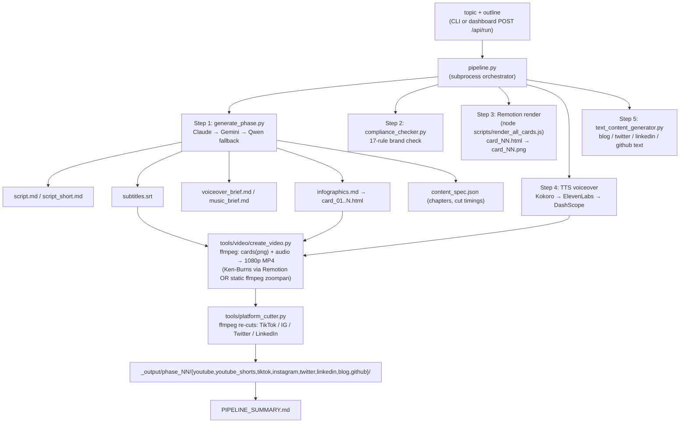
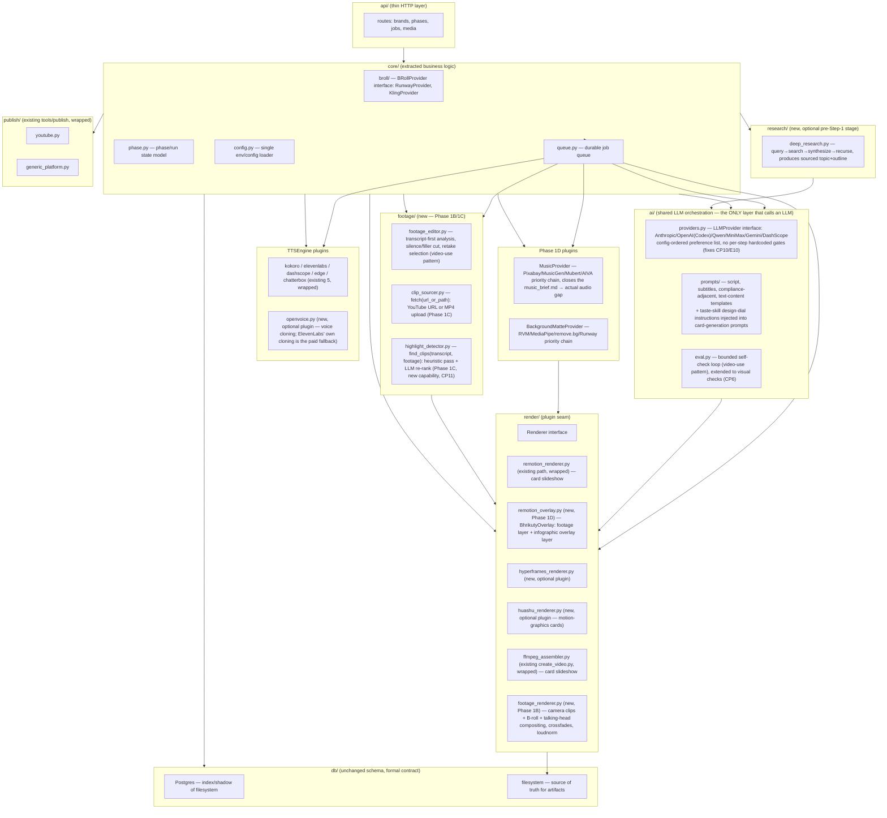
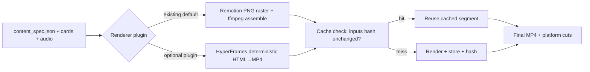
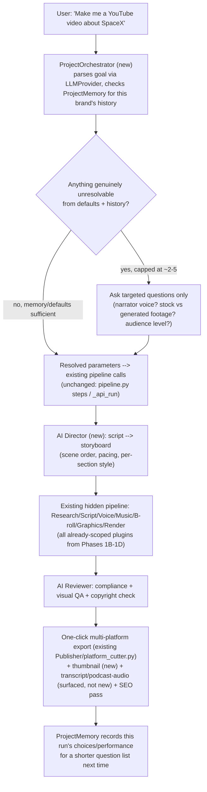

# Bhrikuty Film Director — Architecture Audit & Integration Blueprint

**Scope**: Full audit of `BhrikutyFlimDirector` as it exists today, strength analysis of two primary reference repositories (`browser-use/video-use`, `heygen-com/hyperframes`) plus four supplementary repositories (`myshell-ai/OpenVoice`, `dzhng/deep-research`, `alchaincyf/huashu-design`, `Leonxlnx/taste-skill`), gap analysis, and a redesign/integration plan ("Bhrikuty 2.0"). No code is changed by this document — this is a planning/spec revision only.

---

## Executive Summary

Bhrikuty Film Director is a **working, single-operator content factory**: given a brand profile and a topic, it produces a script, subtitles, branded infographic cards, a voiceover, a rendered video, and an 8-platform content package (YouTube, Shorts, TikTok, Instagram, Twitter, LinkedIn, blog, GitHub). It runs today, with four real brands already in production under `youtube_scripts/setup/projects/` (`chain_clarity`, `ecoWorld`, `loksewawithmanoj`, `manojsir`). That is the most important fact to preserve through any redesign.

It is also, structurally, a **script collection wearing a pipeline's clothes**: a 1,715-line hand-rolled `http.server` (`server.py`) shells out via `subprocess` to a 372-line orchestrator (`pipeline.py`), which shells out again to a dozen independent CLI scripts in `tools/`. There is no shared domain model — state is passed almost entirely through the filesystem (`youtube_scripts/setup/projects/{brand}/phase_N/*.md|json`) and re-parsed with regexes on every read. Remotion is present but used narrowly, as a Ken-Burns slideshow renderer for static cards — not as a general animation/timeline engine. There is no queue, no test suite of consequence, no CI, and no linting configuration.

None of this is a crisis. It is exactly the shape a project takes when one person moves fast from idea to working product using scripts + an LLM. The risk is compounding: `server.py` and `generate_phase.py` are already near 800–1,700 lines each and every new platform, TTS engine, or AI provider is added by appending another `if/elif` branch or another top-level script. The two reference repos (`video-use`, `hyperframes`) are useful precisely because they demonstrate two disciplined patterns Bhrikuty is missing: **text-first, token-cheap AI reasoning over structured data** (video-use) and **declarative, deterministic, seekable video composition** (HyperFrames) — both are direct upgrades to Bhrikuty's current "MP4 in, MP4 out, hope for the best" rendering model and its ad-hoc prompt-per-script AI usage.

The recommended path is **evolutionary, not a rewrite**: extract the existing logic into a small number of real modules (`core/pipeline`, `core/brand`, `core/render`, `core/ai`), put a job queue under the already-async job model in `server.py`, and introduce HyperFrames-style declarative composition and video-use-style transcript-first editing as **optional, additive plugins** behind the existing Remotion path — never replacing what already renders video today.

Four supplementary repositories were also evaluated at the user's request and slot into the same plugin-seam model without changing the core recommendation: **OpenVoice** (voice cloning) becomes a sixth `TTSEngine` plugin; **deep-research** becomes an optional pre-Step-1 "Research" stage that turns a rough idea into a sourced topic+outline; **huashu-design**'s brand-asset-discovery pattern upgrades `tools/init_brand.py`'s manual color-entry flow, and its animation/motion-graphics engine is a candidate upgrade path for the infographic-card step; **taste-skill** is not a pipeline stage at all but a prompt-injection/design-quality layer applied to the LLM calls that already generate HTML cards (`generate_phase.py`) and, optionally, the dashboard's own front-end. See the new "Supplementary Repositories" section after Phase 4 for the full analysis.

**Revision (new output requirements)**: the product scope now explicitly includes two additions, both layered on top of the existing card-slideshow output, never replacing it:
1. **Raw-footage editing** — camera clips, talking-head video, and AI-generated B-roll compositing (**PHASE 1B**). This was previously out of scope (Phase 1's own README quote: *"video generated from infographic cards + voiceover — no camera required"*), and Phase 3's original conclusion said video-use's footage-editing feature set didn't apply *for that reason*. That reasoning no longer holds — see the revised Phase 3 note.
2. **A viral-clips trimmer/editor** — given a YouTube URL or an existing MP4, automatically find and export branded short-form clips per platform (**PHASE 1C**), reusing most of the existing branding and platform-export machinery plus one genuinely new capability, highlight/virality detection.

Both additions must run through **every output format Bhrikuty supports**, verified by a single, repeatable **DEMO & VALIDATION** run (new section) rather than assumed to work. A direct question about LLM provider requirements is answered in a new **LLM Provider Strategy** section: Bhrikuty does not need to be locked to Anthropic specifically — a confirmed bug (`pipeline.py` hardcoding a check for `ANTHROPIC_API_KEY` in one step) is what currently makes it look that way, and the fix generalizes the AI layer into a genuine multi-provider interface (Claude, Codex/OpenAI, Qwen, MiniMax, Gemini, DashScope). Separately, Remotion/ffmpeg rendering and clip-cutting themselves were never LLM-dependent at all — the LLM only writes the text/timing content *before* rendering starts, which is why format changes to those steps carry zero LLM-provider risk.

New **CHOKE POINTS** (bottlenecks that must be fixed *before* any of this — or any future engine/platform — can be added safely) and an **ERROR CHECKLIST & REVERIFICATION** table (confirmed bugs, plus a re-run checklist to confirm they're actually fixed once implementation is done, not just believed fixed) are documented in full below.

**Revision (product/UX layer)**: direct product feedback on an earlier version of this audit identified the real remaining gap once Phases 1B–1D are built: the system is still **pipeline-oriented** (phases, providers, rendering paths exposed to the user) rather than **outcome-oriented** ("I want to make a video," everything else automatic, à la Canva/CapCut/Cursor AI). **PHASE 10** (new, at the end of this document) maps that entire vision — a universal input model, a hidden pipeline, an AI-Editor intake flow, one-input-many-outputs, progressive question-asking, a Project Intelligence memory layer, and five named "AI modules" (Director/Editor/Designer/Producer/Reviewer) — onto what's already scoped in Phases 1B–1D. Most of it turns out to already exist as a plugin interface; the genuinely new pieces are a `ProjectOrchestrator` (intake/question-asking), an `ai/director.py` (storyboard/pacing planning — the one AI module with no prior mapping), a `ThumbnailGenerator`, and a `ProjectMemory` layer (cross-project learning) — scoped as the final Stage 7, deliberately last, since it needs the plugin system underneath to be real and stable before it can safely hide that complexity from the user.

---

## PHASE 1 — Repository Audit

### Repository Structure

```
BhrikutyFlimDirector/
├── server.py                 # 1,715 lines — HTTP server + ALL API routes + dashboard logic
├── pipeline.py                # 372 lines — CLI orchestrator, shells out to tools/*
├── install.py                 # setup/bootstrap script
├── db/                        # optional PostgreSQL layer
│   ├── db.py                  # 505 lines — connection + all queries (brands, runs, steps, versions)
│   ├── schema.sql             # 7 tables: brands, phases, pipeline_runs, pipeline_steps,
│   │                          #   generated_files, compliance_logs, content_specs
│   ├── migrate.py, sync.py
├── tools/                     # ~15 independent CLI scripts, no shared package structure
│   ├── generate_phase.py      # 770 lines — AI script/content generation (Claude→Gemini→Qwen)
│   ├── compliance_checker.py  # 419 lines — 17-rule brand compliance report
│   ├── platform_cutter.py     # 517 lines — ffmpeg cuts for TikTok/IG/Twitter/LinkedIn
│   ├── text_content_generator.py
│   ├── init_brand.py, generate_phase.py, debug_ffmpeg.py, debug_pipeline.py
│   ├── video/create_video.py  # 691 lines — ffmpeg video assembly from cards+audio
│   ├── video/remotion_composer.py, setup_remotion.py
│   ├── tts/                   # 5 parallel TTS engine scripts (kokoro, elevenlabs, dashscope, edge, chatterbox)
│   ├── publish/                # YouTube + generic platform publishers (OAuth)
│   ├── research/apify_trends.py
│   └── social_apis/            # vendored third-party repo (nested .git — see Problem #C7)
├── remotion/                   # Remotion sub-project (Node/TS), narrow usage — see below
│   └── src/{Root,Composition,ShortsComposition}.tsx, index.ts
├── youtube_scripts/setup/projects/{brand}/     # ALL PERSISTENT STATE lives here as files
│   └── phase_N/{script.md, subtitles.srt, content_spec.json, voiceover/, clips/, .versions/}
│   └── _output/phase_NN/{youtube,tiktok,instagram,twitter,linkedin,blog,github}/
├── dashboard.html, projects.html, brand.html, tools.html, phase_dashboard.html  # static frontend, no framework
├── video-use/                  # EMPTY placeholder (confirmed 0 entries) — reference repo not actually vendored
├── prompt-master/               # EMPTY placeholder (confirmed 0 entries)
├── Qwen3-TTS/                   # EMPTY placeholder (confirmed 0 entries) — TTS is actually implemented as tools/tts/*.py calling the DashScope API, no vendored SDK
├── claude_project/ECC/          # EMPTY placeholder (confirmed 0 entries), nested two levels deep
├── myvideo/                     # standalone hand-built demo project (raw clips, ffmpeg edit scripts, QA screenshots) — not integrated with the youtube_scripts/setup pipeline at all
├── .env / .env.example         # ~20 optional API keys, single flat namespace
└── requirements.txt             # anthropic, google-genai, psycopg2-binary; TTS/video deps commented out
```

Two folders named in the original prompt as sources of inspiration — `video-use/` and `prompt-master/` — already exist as **empty directories** in the repo. Nothing has been vendored into them; this audit treats both reference projects as external (GitHub-hosted), not local.

### Architecture Classification

Bhrikuty is a **script-oriented monolith**, not a layered/clean/DDD/modular architecture:

- **Not a monorepo** in the packages sense — `remotion/` is the only isolated sub-project with its own `package.json`; everything else is flat Python at the repo root or in `tools/`.
- **No layering**: `server.py` mixes HTTP transport, routing, business logic (pipeline step computation, script/infographic text analysis via regex, brand compliance status parsing), and persistence access in one file. There's no controller/service/repository split.
- **No domain model**: a "brand," "phase," or "pipeline run" exists only as a JSON blob on disk or a row shape returned by `db/db.py`; no shared Python class represents them. Every script re-implements its own path-building (`PROJECT_ROOT / project / f"phase_{phase}"`) and its own light parsing.
- **Orchestration = subprocess chaining**: `pipeline.py` doesn't call functions from `tools/*.py`, it launches them as separate OS processes via `subprocess.run([sys.executable, tool_path, ...])`. This buys process isolation and crash containment (one tool crashing doesn't take down the server) at the cost of no shared in-memory state, no typed interfaces between steps, and slower iteration (every step pays Python startup cost).
- **Persistence is dual and best-effort**: the filesystem (`phase_N/*.md|json`, `.versions/`) is the source of truth; PostgreSQL (`db/db.py`) is a shadow index that every write wraps in `try/except Exception: pass`. This is a deliberate and reasonable choice (`db_available()` gates everything, server runs fine with `_DB = False`), but it means the DB can silently drift from disk state with no reconciliation beyond the manual `db/sync.py`.

### Video Pipeline



Key characteristics:
- **No raw footage required** — the "video" is a slideshow of AI-generated HTML/PNG infographic cards, a TTS voiceover track, and burned subtitles. This is a real strength for a solo/no-camera creator workflow, but it also means "video pipeline" here is closer to **slides + audio + captions** than to editing actual footage.
- **Remotion's role is narrow**: `Root.tsx` defines exactly two compositions (`BhrikutyVideo` 1920×1080, `BhrikutyShorts` 1080×1920). `Composition.tsx` implements one visual idea — cycle through card images with a Ken-Burns zoom, cross-fade, and a subtitle overlay keyed by wall-clock time lookup (`subtitles.find(c => timeSec >= c.start && ...)`, an O(n) scan per frame, fine at this scale but not how a timeline engine would do it). There is no multi-track timeline, no transition library, no reusable animation primitives — every new visual idea would mean hand-writing more interpolate/spring calls in this file.
- **Three disconnected rendering paths coexist, confirmed by direct inspection of `tools/video/*`**:
  1. `create_video.py` (691 lines) — screenshots each HTML infographic card via **Playwright headless Chromium** (falling back to Pillow-drawn slides if Playwright is unavailable), builds ffmpeg cross-fade clips, mixes in the voiceover, burns subtitles. **This path does not use this repo's Remotion project at all.**
  2. `remotion_composer.py` — stitches **pre-rendered MP4 scene files** from an external directory, defaulting to `D:\claude_project\LearnRemotion\out` (overridable via `REMOTION_OUT_DIR`). This is a *sibling project outside this repo* — meaning the "real" narrative-scene Remotion work Bhrikuty's video-assembly step depends on for one of its two paths lives outside the audited repository entirely.
  3. `remotion/` (this repo's own Node project) — renders only the **infographic-card Ken-Burns slideshow** via `pipeline.py`'s `step_remotion_render` → `render_all_cards.js`, invoked as Step 3 of the pipeline, producing card PNGs that `create_video.py` then assembles with ffmpeg.

  So "Remotion integration," concretely, means: this repo's Remotion renders static cards to images (consumed by path 1), while a *different, unaudited* Remotion project elsewhere on disk produces the scene video that path 2 consumes. `server.py:_api_run_step` exposes both `create_video` and `remotion_compose` as selectable `cmd_type`s from the dashboard with no visible guidance on which to use when — a genuine architectural seam, not just a naming ambiguity.

### AI Pipeline

- **Orchestration pattern**: each tool (`generate_phase.py`, `text_content_generator.py`) independently implements its own provider fallback chain (`try: import anthropic ... except: try: import google.genai ...`). This logic is duplicated across scripts rather than shared.
- **Fallback chain**: Claude Sonnet (primary) → Gemini Flash → Qwen3/DashScope (OpenAI-compatible endpoint) → ChatGPT (per README, not confirmed at the code layer checked). Provider choice is a per-call `--provider` CLI flag, `auto` by default.
- **No agent framework**: there is no planning loop, no memory store, no tool-use/function-calling abstraction, no evaluation loop. Every "AI step" is a single prompt-in-markdown-out call (generate a script, generate subtitles, generate a compliance-adjacent text) — closer to templated prompt scripts than to an agent architecture. This is consistent with the product's actual need (deterministic content generation, not autonomous decision-making) and is **not** automatically a problem — see Phase 3/4 comparison for where this matters.
- **Compliance checking is rule-based, not LLM-based**: `compliance_checker.py` (419 lines) appears to run 17 fixed rules against generated content rather than asking an LLM to judge compliance — a reasonable choice for determinism and cost.

### LLM Provider Strategy — Does Bhrikuty Need an Anthropic Key?

Directly answering a question raised during this audit's revision: **today, practically yes, and one specific place this shows up is a bug, not just a limitation.**

- `generate_phase.py`'s own fallback logic is genuinely flexible: it will run on Gemini or Qwen/DashScope alone if `ANTHROPIC_API_KEY` isn't set (confirmed: `sys.exit(1)` only triggers if **none** of the three keys are present).
- But `pipeline.py`'s Step 5 (`text_content_generator.py` — the platform-text step: blog, Twitter thread, LinkedIn article, GitHub README) is gated by a **hardcoded, provider-specific check**: `if not args.skip_text and "ANTHROPIC_API_KEY" in os.environ`. This means Step 5 is silently skipped whenever Anthropic isn't configured — **even if Gemini or DashScope successfully generated the script in Step 1** using the exact same fallback mechanism that Step 5 doesn't respect. This is a confirmed inconsistency, tracked below as **E10**.
- "ChatGPT" appears in the README's advertised fallback chain (*"Claude → Gemini → ChatGPT → Qwen3"*) but **no OpenAI/Codex API call exists anywhere in the audited code** — another documentation/code mismatch (added to the Error Checklist as **E11**).
- **Qwen** is real and working (DashScope, OpenAI-compatible endpoint, already wired in `generate_phase.py`).
- **MiniMax** and **Codex** are not supported today, at any layer.

**Where the LLM boundary actually sits (important for scoping every future engine addition correctly)**: Remotion, ffmpeg-based clip cutting, and infographic-card *rendering* need **zero LLM calls at render time** — they are pure compositing steps that read already-generated text/timing/image files (`content_spec.json`, `card_NN.html`, `subtitles.srt`) and produce video frames. The LLM is used exactly once, upstream, in Step 1 (`generate_phase.py`), to *write* that text/timing content before rendering ever starts. This means: (a) `HighlightDetector`/`FootageEditor`/`ResearchProvider` (all new, above) are the only places besides Step 1 that need an LLM at all — every rendering/compositing/platform-cutting step remains LLM-free exactly as it is today; (b) whichever provider generates that upstream content, any of Claude/Codex/Qwen/MiniMax/Gemini/DashScope is equally sufficient — the choice of LLM provider has **no bearing whatsoever** on Remotion's or ffmpeg's ability to cut clips or populate infographics, since by the time those tools run, the content is already static text/data on disk.

**The fix, generalized rather than patched**: the `ai/providers.py` shared module already planned in Phase 6 should be a genuine **provider-agnostic `LLMProvider` interface** — `complete(prompt, system_prompt) -> str` — with each provider (Claude, OpenAI/Codex, Gemini, Qwen/DashScope, MiniMax, and any future OpenAI-compatible endpoint) as an equally-weighted implementation selected by **config, not by which specific env var happens to be set for which specific step**. Concretely: one ordered provider-preference list (configurable per brand or globally, e.g. `LLM_PROVIDER_ORDER=anthropic,openai,qwen,minimax,gemini`) consulted identically by *every* generation step (script, subtitles, text-content, compliance-adjacent prompts, and the new Research/HighlightDetector/FootageEditor steps below) — so no step can silently behave differently depending on which specific key happens to be present, the way Step 5 does today. This turns "does it need an Anthropic key" from "yes, for one step, due to a bug" into "no — any one of Claude/Codex/Qwen/MiniMax/Gemini/DashScope is sufficient, and all of them work identically across every step."

### Remotion Integration — Strengths / Weaknesses / Limitations

**Strengths**: type-safe props (`Props` type in `Composition.tsx`), clean separation of `BhrikutyVideo` vs `BhrikutyShorts` compositions, correct frame-based (not wall-clock) animation via `useCurrentFrame`/`interpolate`/`spring`.

**Weaknesses**: only one animation idea implemented (Ken-Burns + crossfade); brand colors/watermark are half-wired (`{/* Brand name is injected by setup_remotion.py */}` — a comment, not actual injected content); subtitle lookup is a linear scan with no memoization; no dynamic composition registration — the two IDs are hardcoded in `Root.tsx`.

**Limitations**: Remotion here renders **cards to images**, not final video — the actual MP4 assembly happens in ffmpeg (`create_video.py`), so Bhrikuty gets none of Remotion's biggest advantages (audio mixing, transitions-as-code, `renderMedia` server-side rendering, Lambda-based distributed rendering) for the step that matters most (final render). Compounding this, the *other* video-assembly path (`remotion_composer.py`) depends on a full narrative-scene Remotion project that isn't part of this repository at all (see Video Pipeline section) — so the repo's actual Remotion capability is split across two projects, only one of which was available to audit.

### API Layer

`server.py` implements a hand-rolled `http.server.BaseHTTPRequestHandler` with **~25 GET routes and ~10 POST routes** dispatched via long `if/elif re.match(...)` chains in `do_GET`/`do_POST` (server.py:230-437). There is:
- **No auth or authorization at all** — every route is open; this is a localhost dev dashboard today, but the same code path (`_serve_media`, `_api_file`) does its own path-traversal filtering ad hoc per-handler (`if any(c in filename for c in ("../", "..\\", "/", "\\"))`) rather than through one shared, tested guard.
- **No request validation layer** — JSON bodies are `json.loads()`'d and read with `.get()` defaults inline in each handler; malformed input mostly degrades to a default rather than a 400, which is forgiving but inconsistent.
- **Streaming jobs via SSE** (`_stream_job`, server.py:524-554) implemented directly with `BaseHTTPRequestHandler` and a `queue.Queue` per job — functionally works but is fragile (no reconnection/resume semantics beyond replaying a buffered list; one thread per job with `daemon=True` and no cap on concurrent jobs).

### Database

- **ORM**: none — `db/db.py` (505 lines) is raw `psycopg2` with hand-written SQL and `try/except` wrapping every call so the app degrades gracefully when Postgres is absent.
- **Schema** (`db/schema.sql`): 7 tables — `brands`, `phases`, `pipeline_runs`, `pipeline_steps`, `generated_files`, `compliance_logs`, `content_specs`. Reasonable normalization (FKs from `phases`/`pipeline_runs` to `brands.slug`), sensible indexes, `updated_at` triggers. `JSONB` used appropriately for variable-shape brand config (colors, tone, platforms).
- **Migrations**: `db/migrate.py` exists but the schema file itself uses `CREATE TABLE IF NOT EXISTS` rather than a numbered migration chain — fine at current scale, will become a liability once the schema needs to evolve under real data.
- **Confirmed drift between `schema.sql` and `migrate.py`**: `db.py` actively calls `record_asset_version`/`list_asset_versions`/`log_content_view`/`get_view_counts` against `asset_versions` and `content_views` tables that exist **only** in `migrate.py`'s migration list, not in `schema.sql` — a fresh `psql -f db/schema.sql` run (as the file's own header instructs) would leave the DB missing two tables the app depends on. `migrate.py` must run afterward for the schema to actually match the code.
- **Confirmed `DB_NAME` default mismatch**: `db/db.py` defaults to `"press_jemc"`; `db/migrate.py` defaults to `"bhrikutyflimdirector"`; `install.py`'s `apply_db_schema()` uses `"press_jemc"`. Anyone who doesn't set `DB_NAME` explicitly in `.env` will have different scripts silently talking to two different databases.
- **Design quality**: solid for what it is — a lightweight run/version index shadowing the filesystem. The double-source-of-truth relationship with the filesystem (see Architecture section) is the real design risk, not the schema itself.

### Queue System

**None exists.** `_api_run` in `server.py` spawns a raw `threading.Thread(target=worker, daemon=True)` per job with no concurrency limit, no retry, no priority, and no persistence of in-flight jobs across a server restart (`jobs: dict` is in-memory only — server.py:58). Recommendation: introduce a minimal durable queue (even SQLite-backed or Postgres-backed given `db/db.py` already exists) before job volume grows past "one operator running phases manually."

### Assets

- **Images/HTML cards**: `phase_N/infographic_assets/*.html` + `cards_manifest.json`, rendered to PNG by Remotion.
- **Audio**: `phase_N/voiceover/*.{wav,mp3,ogg,m4a}`, first-match-wins selection (`_analyze_voiceover` just takes `audio[0]`).
- **Video**: `phase_N/clips/*.mp4` (manual raw uploads) and `_output/phase_NN/{platform}/*.mp4` (generated).
- **Fonts/Templates**: brand fonts/colors live in `brand_profile.json` as JSON, consumed ad hoc by `create_video.py`/Remotion; no template registry.
- **Storage**: entirely local filesystem, no object storage abstraction — this will block any multi-machine or cloud-rendering future without a rewrite of every path-joining call site.
- **Caching**: `.versions/{step}/vN/` gives ad hoc version history (nice feature, home-grown) but there is no rendering cache (e.g., don't re-render a card whose inputs haven't changed) — HyperFrames' deterministic-seek model directly addresses this gap.

### Configurations

`.env` / `.env.example`: ~20 flat, ungrouped environment variables (one per provider/API) loaded by three separate hand-rolled parsers (`server.py:26-32`, `pipeline.py:31-38`, `generate_phase.py` similarly) — the same 6-line `.env` loader is copy-pasted at least 3 times. No config schema/validation, no feature flags, no environment separation (dev/staging/prod) — reasonable for a single-operator local tool, a gap if this becomes a hosted product.

### Developer Experience

- **Linting/formatting**: none configured (no `.flake8`, `pyproject.toml`, `ruff.toml`, `.prettierrc` found).
- **Testing**: one test file, `projects/test_hello.py`, testing an unrelated `hello.py` greeter — **not connected to any real pipeline code**. Effectively zero *automated, CI-enforceable* test coverage of `server.py`, `pipeline.py`, `tools/*`, or `db/*`. There is an informal manual substitute: `tools/debug_pipeline.py` + `tools/debug_ffmpeg.py`, invoked via `tools/run_debug.sh`/`.bat`, which check system prerequisites, run real ffmpeg encode/cut/concat/scale/subtitle/audio smoke tests, and exercise a real render pipeline, emitting `debug_report.md`. It's a genuine integration smoke-test harness — just developer-invoked, not automated or gating any commit/merge.
- **CI/CD**: no `.github/workflows` found — no automated build/test/lint on push.
- **Documentation**: strong for a solo project — `README.md` and `GETTING_STARTED.md` are detailed and largely accurate to the code (verified: pipeline steps, AI fallback chain, and file layout described in the README match what `pipeline.py`/`server.py` actually do), though not perfectly in sync — `.env.example` omits `GEMINI_API_KEY` and all `DB_HOST`/`DB_PORT`/`DB_NAME`/`DB_USER`/`DB_PASSWORD` variables despite both being required by code the README describes. `tools/TOOL_GUIDE.md` documents the tools directory with cost/quality comparisons per engine.
- **Scripts/automation**: `tools/run_debug.sh` / `.bat`, `tools/debug_pipeline.py`, `tools/debug_ffmpeg.py` exist as ad hoc debug entry points, not a unified `make`/`justfile`/`npm run` task surface. `install.py` (435 lines, not detailed above) is a separate one-time bootstrap CLI handling pip/npm installs and schema application — itself independent of, and duplicating config logic with, `pipeline.py`/`server.py`.

---

## PHASE 1B — New Output Requirement: Raw-Footage & B-Roll Video

This is a genuine addition to the product, not a documentation nuance. **Everything in Phase 1 stays exactly as-is** — the card-slideshow output remains a first-class, default output format. This section adds a second, parallel output family: video assembled from real camera footage and/or AI-generated B-roll, with optional talking-head content.

### What already exists to build on

Two things in the current codebase are directly relevant, both currently dead-ended:
- **Raw clip upload already exists**: `POST /api/upload-clip` (`server.py`) writes into `phase_N/clips/*.mp4`, and `pipeline.py`'s own usage comment shows the intended path — `python pipeline.py --project X --phase N --skip-generate --video path/to/recording.mp4`. Nothing currently *does* anything with that uploaded clip beyond storing it; `create_video.py`'s actual card-to-slideshow logic doesn't branch on its presence.
- **B-roll API keys are already cataloged, never called**: `.env.example` lists `RUNWAY_API_KEY` (Runway Gen-4, ~$0.05/sec) and `KLING_API_KEY` (Kling AI, $7.99/mo) under "VIDEO B-ROLL." A repo-wide search confirms no script reads either key or calls either API — they are aspirational configuration only. Same finding applies to `BFL_API_KEY`/`IDEOGRAM_API_KEY`/`OPENAI_API_KEY` under "IMAGE GENERATION" and `CREATOMATE_API_KEY` under "CLOUD RENDERING" — all cataloged, none implemented.

### What this requirement actually needs, broken into pieces

1. **A `BRollProvider` plugin interface** — `generate_broll(prompt: str, duration_s: float, style: BrandStyle) -> Path`, with `RunwayProvider` and `KlingProvider` as the first two implementations, finally making the already-documented `.env` keys real. Selection logic (cost/quality tradeoff, same pattern as the existing TTS priority chain) belongs in `core/`, not duplicated per script.
2. **A footage-aware `Renderer` path** — today's `Renderer` interface (Phase 6) is scoped around card-slideshow assembly; it needs a second concrete mode — call it `FootageRenderer` — that takes an ordered list of {uploaded clip | generated B-roll | talking-head clip} segments plus the voiceover/subtitle track and produces cuts, transitions, and a final assembly, instead of card-cycling.
3. **Talking-head support** — the simplest version is just: an uploaded talking-head clip (already possible via `/api/upload-clip`) becomes one segment type the `FootageRenderer` composites against B-roll/cards, exactly like a real editor's A-roll/B-roll split. AI-generated talking-head/avatar video (HeyGen-style) is explicitly **out of scope for this pass** — none of the six repos evaluated so far provide it, and it should be tracked as a distinct future `AvatarEngine` interface (Phase 9) rather than bundled into this requirement.
4. **video-use's pattern is now directly applicable, not just its methodology** — Phase 3's original conclusion (*"video-use is built around editing existing footage... Bhrikuty's core product deliberately has no raw footage... only the analysis/evaluation methodology transfers"*) is **superseded** by this requirement. With real camera clips and B-roll now in scope, video-use's actual value proposition — transcript-first analysis of raw footage, silence/filler detection, retake selection — becomes a real, reusable pattern for a `FootageEditor` step that runs *before* the `FootageRenderer` assembles the final cut, not merely an evaluation-loop template.
5. **Compliance and evaluation extend to visual content** — `compliance_checker.py`'s current 17 rules are text/color/font-based and cannot inspect a B-roll clip or a talking-head recording for brand fit; the self-evaluation loop (`ai/eval.py`, Phase 6) needs to grow a visual check (does the B-roll clip match the requested prompt/mood, is the talking-head clip in frame/lit adequately) once real footage is in the mix — see CHOKE POINT #6 below.

### Explicit non-goals for this pass

Do not attempt, in the first implementation of this requirement: AI avatar/talking-head generation (no camera, fully synthetic presenter — track as future work only), live multi-camera editing, or real-time/interactive editing. This keeps the addition scoped to "camera clips + AI B-roll can now be composited into a Bhrikuty video," which is what was asked for.

---

## PHASE 1D — Music, B-Roll Sourcing, In-Video Infographic Overlays & Background Treatment

Every tool recommendation below follows the same fixed priority order the user asked for: **open-source/free first, then cheap, then paid** — and every capability includes what to do when a tier fails to produce a seamless result, so a bad output degrades gracefully to the next tier rather than shipping something broken.

### Brand & background music

Today, `generate_phase.py` already produces `music_brief.md` (mood, BPM range, and search terms — confirmed via `server.py`'s `_analyze_music` parser) but **nothing in the codebase ever fetches or generates an actual audio file from that brief** — it's a half-built feature: the brief exists, the fetch/generate step doesn't. This is the highest-ROI fix in this whole section, because closing that loop needs no new AI capability at all.

| Tier | Tool | Type | Cost | Notes / seamlessness caveat |
|---|---|---|---|---|
| **1 — free, zero infra** | **Pixabay Music API / Free Music Archive / YouTube Audio Library** | Curated royalty-free library, keyword search | Free | Directly consumes `music_brief.md`'s already-generated `search_terms`/mood/BPM — the fastest fix, since it needs no model hosting, just an API call. Ship this first. |
| **1 — free, self-hosted (AI-generated)** | **Meta MusicGen** (open weights, Hugging Face) | Text-to-music generation | Free (GPU compute only) | Generates a track matching the mood/BPM prompt directly rather than searching a library; needs a GPU; raw output is not seamlessly loopable on its own — see fade/trim note below |
| **1 — free, self-hosted (AI-generated)** | **Stable Audio Open** (Stability AI, open weights) | Text-to-audio generation | Free (GPU compute only) | Alternative to MusicGen, different tonal character — worth A/B testing both against the same brief |
| **2 — cheap** | **Mubert API** | Generative music API, hosted | Pay-per-use / subscription (~$10–20/mo) | No GPU needed; tunable by mood/BPM tag in real time |
| **2 — cheap** | **Soundraw.io** | AI-composed royalty-free tracks | Subscription (~$10–20/mo) | More "produced"-sounding output than MusicGen; API access on paid tiers |
| **3 — paid, highest control** | **AIVA** | AI composer, high customization | Paid tiers | Best option if a brand wants a distinctive, ownable theme rather than generic background music |
| **3 — paid, specialty** | **Suno AI** | Text-to-song, including vocals | Credit-based | Overkill for background music; only relevant if Bhrikuty ever wants a themed intro/outro *song*, not ambient background |

**Seamlessness note that applies regardless of tier**: any generated or sourced track needs a loop-safe fade-in/out and duration-matching to the voiceover's actual measured length (ffmpeg `afade` + `atrim` or `-stream_loop`) — this is mixing work, not a property of the music tool, and belongs in the same audio-mixing step that already ducks music under narration (see the seamless-assembly answer given earlier in this conversation).

### B-Roll sourcing (expanding on the two paid keys already cataloged in `.env.example`)

| Tier | Tool | Type | Cost | Notes |
|---|---|---|---|---|
| **1 — free, zero infra** | **Pexels Videos API / Pixabay Videos API / Coverr** | Free stock footage, keyword search | Free | Matches `clip_brief.md`'s shot descriptions directly; zero cost, zero GPU — the tradeoff is these are *stock* clips, not unique generated ones, so duplication across creators is possible |
| **1 — free, self-hosted (AI-generated)** | **Stable Video Diffusion / CogVideoX** (open weights) | Text/image-to-video generation | Free (GPU compute) | Genuinely unique generated clips; needs a capable GPU, and quality/fidelity today is below the paid options |
| **2 — cheap** | **Kling AI** *(already in `.env.example`)* | AI text-to-video | $7.99/mo | Already the documented cheap tier |
| **2 — cheap** | **Pika Labs / Luma Dream Machine** | AI text-to-video | Credit-based, moderate | Alternatives if Kling's visual style doesn't fit a given brand |
| **3 — paid, best quality/control** | **Runway Gen-4** *(already in `.env.example`)* | AI text-to-video | ~$0.05/sec | Already the documented paid tier |

### Voiceover & voice cloning — formalized fallback priority

Bhrikuty's existing engine chain already leans this direction; this makes the ordering and the cloning option explicit end to end:

| Tier | Engine | Cost | Notes |
|---|---|---|---|
| **1 — free, local** | **Kokoro-TTS** *(existing, current default)* | Free, CPU | No cloning |
| **1 — free, local** | **Chatterbox** *(existing)* | Free, GPU | Higher quality than Kokoro, needs a GPU |
| **1 — free, local, cloning** | **OpenVoice** *(new — Phase 4B)* | Free, GPU, MIT license | Adds voice cloning at the free tier |
| **2 — cheap/freemium** | **DashScope/Qwen3-TTS** *(existing)* | Freemium | No cloning |
| **2 — free (hosted, unofficial)** | **Edge-TTS** *(existing)* | Free | No cloning |
| **3 — paid, cloning + best quality** | **ElevenLabs** *(existing engine — worth calling out that it already supports its own voice cloning)* | Paid | If OpenVoice's local-GPU requirement is a blocker, ElevenLabs' hosted cloning is the paid fallback — no new integration needed, it's already wired |

### Background treatment — two distinct meanings, both worth covering

**(a) Backdrop behind cards/text** (already partially built): `Composition.tsx`'s `brandColors.bg` is a flat color today. The refinement is a Remotion-native upgrade, not a new tool — a blurred/dimmed B-roll loop as an animated backdrop layer behind the card/text foreground, using the same layering Remotion already does for Ken-Burns cards.

**(b) Background replacement/removal behind a talking-head clip** (genuinely new capability, needed once real camera footage is composited per Phase 1B):

| Tier | Tool | Type | Cost | Notes |
|---|---|---|---|---|
| **1 — free, self-hosted, best quality** | **Robust Video Matting (RVM)** | Open-source person/background segmentation | Free, real-time capable even on modest GPUs | Best free option for clean edge quality on hair/motion |
| **1 — free, self-hosted, lightweight** | **MediaPipe Selfie Segmentation** (Google) | Open-source | Free | Faster/simpler than RVM, slightly lower edge quality |
| **2 — cheap, hosted** | **remove.bg API** (video support) | Hosted, no GPU needed | Pay-per-second | Good for low-volume use without self-hosting |
| **3 — paid** | **Runway's background-removal/rotoscoping tools** | Hosted, part of the same Runway account already used for B-roll | Paid | Convenient one-vendor option if Runway is already integrated |

### In-video infographic overlays (graphics composited *on top of* moving footage — distinct from full-screen cards)

This needs **no new tool** — Remotion, already in the stack, natively supports a background video layer (footage/B-roll) plus an HTML/CSS overlay layer (stat call-outs, lower-thirds, animated charts) timed with the same `useCurrentFrame`/`interpolate` primitives `Composition.tsx` already uses for card cross-fades. Concretely: a new composition (e.g. `BhrikutyOverlay`) alongside the existing `BhrikutyVideo`/`BhrikutyShorts`, rendering footage in one `<AbsoluteFill>` layer and infographic elements in a second layer on top. HyperFrames (already evaluated, Phase 4) offers the same overlay capability declaratively, as the alternative `Renderer` plugin already scoped. For completeness, two open-source alternatives worth naming even though Remotion already covers this: **Motion Canvas** (open-source, code-driven animation) and **Rive** (open-source, real-time vector animation, well-suited specifically to lightweight animated icons/stat call-outs with lower render overhead than a full Remotion pass).

### Provider Fallback & Escalation Policy (what happens when a tier doesn't produce a seamless result)

This is a design rule, applied uniformly across every capability above (music, B-roll, voice, matting):

1. Every provider call runs through the **same self-evaluation loop** already scoped for `ai/eval.py` (Phase 6, extended for visual checks per CP6) — e.g., a generated B-roll clip is checked against the requested prompt/duration, a matted background is checked for edge artifacts, a generated music track is checked for audible looping seams.
2. **On failure, escalate one tier up** (free → cheap → paid) automatically, bounded to a small number of attempts (same `<3 retries` bound already used elsewhere in the self-eval loop) — never silently ship a failed result, and never escalate indefinitely (cost control, same concern as CP3/CP4).
3. **Surface which tier was actually used** in the phase's output metadata (extending `content_spec.json` or the `PIPELINE_SUMMARY.md` report) — e.g. *"Background music: generated via MusicGen (free tier); B-roll clip 2 of 4: escalated to Kling after Pexels search returned no match."* This gives the operator cost/quality transparency instead of a black box, and doubles as a debugging aid when output quality varies between runs.
4. Each provider tier above becomes one more implementation of the plugin interfaces already defined (`BRollProvider`, `TTSEngine`) or two new ones this section requires: **`MusicProvider`** (`generate_or_fetch(brief) -> Path`) and **`BackgroundMatteProvider`** (`replace_background(clip, target) -> Path`) — following the exact same plugin-seam pattern as everything else in Phase 6, not a special case.

---

## PHASE 1C — New Output Requirement: Viral Clips Trimmer & Editor

A second, related but distinct addition: given a **YouTube URL or an uploaded MP4** (typically an existing long-form video — the operator's own past upload, or a source video they have rights to re-cut), automatically find the strongest moments and produce **branded short-form viral clips/reels** for TikTok/Shorts/Reels-style platforms — not a new video from scratch (that's Phase 1B/Phase 1's job), but a **re-cut of an existing video**.

### Why this is a distinct pipeline, not a restatement of Phase 1B

Phase 1B composites *new* video from camera clips + generated B-roll. This requirement instead takes a *complete existing video* and answers "which 3–5 fifteen-to-sixty-second segments of this are worth clipping out," which is a highlight-detection problem, not a composition problem. It shares infrastructure with Phase 1B (the `FootageEditor`'s transcript-first analysis, `platform_cutter.py`'s existing per-platform crop/export logic) but needs one genuinely new capability: **virality/highlight scoring**.

### What this needs, broken into pieces

1. **`ClipSourcer`** — `fetch(url_or_path: str) -> RawFootage` — downloads a YouTube URL (yt-dlp is the standard tool for this; no such dependency exists in the repo today) or accepts a direct MP4 upload (reusing the existing `/api/upload-clip` endpoint), producing a local file the rest of the pipeline can treat uniformly regardless of source.
2. **`HighlightDetector`** — `find_clips(transcript, footage) -> List[ClipCandidate]` — the genuinely new piece. Two viable approaches, not mutually exclusive: (a) an LLM-scored pass over the transcript (reusing the `LLMProvider` interface below) ranking segments by hook strength/self-contained payoff/emotional peak, in the same spirit as video-use's transcript-first reasoning; (b) simple heuristics (pause patterns, audio energy peaks, caption density) as a cheap first pass before an LLM re-ranks the candidates — cheaper and worth building first, since it needs no new paid API.
3. **Branding pass** — reuses the *existing* brand pipeline almost entirely: `brand_profile.json` colors/fonts, the existing subtitle-burning logic in `create_video.py`/`platform_cutter.py`, and (once built) the taste-skill-informed card/text styling — a branded watermark/intro-card/caption-style overlay applied to each trimmed clip. This is the one place where "no need to check existing brand, we will make it properly" applies most directly: this pass should read from whatever `brand_profile.json` is supplied at call time, generically, rather than hardcoding assumptions from any one of the four current live brands.
4. **Platform export** — this step is **almost entirely already built**: `tools/platform_cutter.py` (517 lines) already does TikTok/Instagram/Twitter/LinkedIn crop-and-export from a master video. The viral-clips pipeline's final step is a thin wrapper calling the same function with the trimmed segment as input instead of the phase's full master render.

### Where it sits in the architecture

`ClipSourcer` and `HighlightDetector` join `footage/` alongside `FootageEditor`/`BRollProvider` from Phase 1B (they share the transcript-first-analysis foundation); the branding + platform-export steps call directly into the existing `Renderer`/`platform_cutter.py` machinery rather than duplicating it. No part of this requires a new `Renderer` implementation — it's a new *source* (`ClipSourcer`) and a new *selection* step (`HighlightDetector`) feeding the *existing* card/footage rendering and platform-cut machinery.

---

## CHOKE POINTS — What Must Be Fixed Before Any New Engine or Platform Is Added Safely

These are the specific bottlenecks in the current design that will turn "add a new engine/platform" from a clean plugin addition into a fragile bolt-on if left unaddressed. Each one blocks — directly or by compounding risk — the raw-footage/B-roll requirement above *and* every other planned addition (OpenVoice, deep-research, HyperFrames, huashu-design). They are ordered by how early in the implementation sequence they must be closed.

| # | Choke point | Why it blocks new engines/platforms | Must be fixed before |
|---|---|---|---|
| CP1 | **No shared config loader / provider-fallback library** — the same `.env` parser and Claude→Gemini→Qwen fallback pattern is copy-pasted across ~9 files | Every new engine (B-roll provider, OpenVoice, deep-research) would duplicate this a 10th time instead of registering with one shared mechanism | Any new engine work (Stage 1–2) |
| CP2 | **Orchestration is subprocess-chaining with file-only handoffs between steps** — `pipeline.py` shells out to each tool as a separate OS process, passing state only via files on disk | A footage-editing loop (video-use pattern) needs iterative, stateful reasoning across steps (transcribe → analyze → cut → re-check); doing that across process boundaries via files is slow and loses in-flight context on every hop | Footage-editing / B-roll work (Stage 2–3) |
| CP3 | **No job queue; jobs are unbounded daemon threads with in-memory-only state** | B-roll generation (Runway/Kling) is slow (seconds–minutes per clip) and directly costs money per call; an unbounded thread with no retry/backoff/cost-cap risks runaway spend on a stuck or retried job, and a server restart silently drops in-flight generation state | **Before any paid B-roll API is wired up — hard blocker, not a nice-to-have** |
| CP4 | **No render/generation cache** — every pipeline re-run regenerates every artifact from scratch | B-roll and voice-cloning calls cost real money per invocation; without an input-hash cache, re-running a phase (which operators already do routinely via `.versions/`) silently re-purchases B-roll clips already paid for once | Before B-roll/OpenVoice go live (Stage 4–6) |
| CP5 | **No single authoritative `Renderer` contract** — video assembly is already split three ways (this repo's Remotion card renderer, `create_video.py`'s ffmpeg path, and `remotion_composer.py`'s dependency on the external `LearnRemotion` project) | Adding `FootageRenderer` as a fourth uncoordinated path repeats the exact problem flagged as P8 in Phase 2 — a genuine `Renderer` interface must exist first so footage-based rendering is a plugin, not a fourth disconnected script | Before Phase 1B implementation begins |
| CP6 | **No visual/self-evaluation loop — success today means "process exited 0"** | Card-slideshow output has a small failure surface (wrong color, bad text); raw footage/B-roll/talking-head compositing has a much larger one (bad sync, jarring cuts, off-brand B-roll, unusable talking-head framing) — shipping this without `ai/eval.py`'s bounded self-check extended to visual content means broken videos will pass silently | Before Phase 1B ships to any real brand |
| CP7 | **No authentication on the API, including the raw-clip upload endpoint** | `/api/upload-clip` already accepts real camera footage (potentially a real person's face/voice) with zero auth and wide-open CORS; this exposure is more consequential once real people's footage — not just AI-generated cards — flows through it | Before Phase 1B is exposed beyond `localhost` |
| CP8 | **Compliance checking is text/color-rule only, structurally unable to inspect video/image content** | Cannot verify a Runway/Kling B-roll clip or an uploaded talking-head clip against brand guidelines the way it verifies script text today | Needs a new visual-compliance check, not a fix to the existing checker |
| CP9 | **`.env.example` catalogs capabilities (B-roll, image-gen, cloud rendering) that no code implements**, and separately omits variables the code *does* require (`GEMINI_API_KEY`, `DB_*`) | Anyone extending the system can't currently tell "documented-and-real" from "documented-but-aspirational" from ".env.example itself is incomplete" — this ambiguity is exactly what makes new-engine work error-prone | Immediate — a Stage 1 quick win, and a precondition for the B-roll work being anything other than "wire up a key that was already sitting there unused" |
| CP10 | **LLM provider selection is hardcoded per-step rather than config-driven** — `pipeline.py` Step 5 checks specifically for `ANTHROPIC_API_KEY` rather than "is any provider available," so which steps run depends on which specific key is set, not on whether the system as a whole is usable (E10/E11) | Every new engine added on top of the current AI layer (deep-research, HighlightDetector, the visual-eval loop) would inherit this same per-step, per-provider-name gating pattern unless the shared `LLMProvider` interface (LLM Provider Strategy section) is built first — otherwise "add MiniMax support" means finding and fixing N hardcoded gates instead of adding one entry to a provider list | Before Stage 4 (Plugin system) — this is what makes Codex/Qwen/MiniMax support "flawless" rather than another per-script special case |
| CP11 | **No highlight/virality-scoring capability exists at all** — `platform_cutter.py` re-cuts a *known* master render into platform shapes; nothing decides *which segment* of an arbitrary long video is worth clipping | The viral-clips requirement (Phase 1C) cannot be built as "just call `platform_cutter.py` on a new input" — the missing piece is `HighlightDetector`, a genuinely new AI capability, not a re-wire of an existing one | Phase 1C implementation (Stage 5–6) |

---

## ERROR CHECKLIST & REVERIFICATION

Every item below is a **confirmed** issue found during the audit (Phase 2, Phase 1 database/config detail), or a **new risk** introduced by the raw-footage/B-roll requirement. Each has a concrete, repeatable check — use the same check both to confirm the bug exists now and to reverify it's actually fixed after implementation, rather than trusting "it should be fixed" from memory.

| ID | Error | How to verify it exists today | How to reverify it's fixed | Status |
|---|---|---|---|---|
| E1 | `DB_NAME` default mismatch (`press_jemc` in `db/db.py`/`install.py` vs `bhrikutyflimdirector` in `db/migrate.py`) | `grep -n "DB_NAME" db/db.py db/migrate.py install.py` — confirm differing string literals | Re-run the same grep; all three must default to the same value (or all three must require the env var explicitly with no silent default) | ☐ Not yet fixed |
| E2 | `schema.sql` missing `asset_versions`/`content_views` tables that `db.py` queries | Fresh `psql -f db/schema.sql` against an empty DB, then run any code path calling `record_asset_version`/`log_content_view` — confirm it errors on missing table | Repeat the same fresh-DB + code-path test; confirm no missing-table error, and confirm `schema.sql` alone (without needing `migrate.py` afterward) creates every table `db.py` uses | ☐ Not yet fixed |
| E3 | `.env.example` omits `GEMINI_API_KEY` and all `DB_HOST`/`DB_PORT`/`DB_NAME`/`DB_USER`/`DB_PASSWORD` vars the code reads | `grep -oE "os\.environ(\.get)?\(['\"][A-Z_]+" -r .` across the repo, diff the resulting variable set against `.env.example`'s documented keys | Re-run the same diff; the two sets must match exactly (every var the code reads is documented; nothing documented is dead) | ☐ Not yet fixed |
| E4 | Video assembly split three ways, one path (`remotion_composer.py`) depending on an external, unaudited sibling project (`D:\claude_project\LearnRemotion`) | Read `tools/video/remotion_composer.py`'s `REMOTION_OUT_DIR` default; confirm it points outside this repo | After the `Renderer` interface (Phase 6/CP5) exists, confirm there is exactly one authoritative entry point per output type, and that any external-repo dependency is either vendored/declared or removed | ☐ Not yet fixed |
| E5 | `tools/social_apis/social-media-apis-3268` is a nested git repo, not a declared submodule | `git status` from the repo root; a nested `.git` under a tracked path produces confusing/incomplete status output | Confirm `git submodule status` lists it properly, or confirm it's been removed/replaced with a static snapshot | ☐ Not yet fixed |
| E6 | Path-traversal guards are hand-rolled per-endpoint in `server.py`, not centralized, and not applied consistently | Grep `server.py` for `"../"` — confirm the check is repeated inline in some handlers (`_api_save_file`, `_api_file`) and check whether every file-accepting endpoint (including the newer `/api/upload-clip`) has it | Confirm a single shared guard function is imported and called by every endpoint that accepts a filename/path parameter, with a test asserting a `../` payload is rejected on each one | ☐ Not yet fixed |
| E7 (new) | B-roll/voice-cloning API calls have no cost cap, no retry/backoff policy, and no idempotency guarantee | N/A (feature doesn't exist yet) — this is a design requirement to build in, not a bug to find | Test: run the same phase twice with unchanged inputs against a stubbed Runway/Kling/OpenVoice provider; confirm the second run does **not** re-invoke the paid API (cache hit) and confirm a simulated timeout/error triggers a bounded retry, not an unbounded one | ☐ Design requirement — build with test |
| E8 (new) | Footage/B-roll compositing could fail partway (corrupt clip, mismatched codec) while still exiting 0 | N/A (feature doesn't exist yet) | Test: feed the `FootageRenderer` a deliberately corrupt/truncated clip; confirm the pipeline reports failure (non-zero exit, or a failed status in the job/DB record) rather than silently producing a partial or broken video | ☐ Design requirement — build with test |
| E9 | None of E1–E8 are caught by an automated test today — every check above is manual | Confirm `projects/test_hello.py` is still the only test file, unrelated to any of the above | After Stage 3 (Phase 8) testing work, confirm a pytest suite exists with at least one automated test per E1, E2, E3, E5, E6, E7, E8 (E4 is architectural, verified by code review rather than a unit test) | ☐ Not yet fixed |
| E10 (new) | `pipeline.py` Step 5 (text content) is gated on `"ANTHROPIC_API_KEY" in os.environ` specifically, ignoring that Gemini/DashScope may have already generated the script successfully via the same fallback chain Step 1 uses | `grep -n "ANTHROPIC_API_KEY" pipeline.py` — confirm the literal string-keyed gate on Step 5 | Confirm Step 5 instead checks "is any `LLMProvider` configured" (the same shared check every other step uses), by running a phase with only `GEMINI_API_KEY` set and confirming Step 5 still executes | ☐ Not yet fixed |
| E11 (new) | README advertises a "ChatGPT GPT-4o" fallback tier that has no corresponding OpenAI API call anywhere in the codebase | `grep -rn "openai\|OpenAI" --include="*.py"` across the repo — confirm no client instantiation/call exists outside of comments/README | Once `LLMProvider` gains an OpenAI/Codex implementation (see LLM Provider Strategy section), confirm the same grep now finds a real client call, and update the README's fallback-chain claim to match reality (or vice versa — implement it, or correct the docs, but stop letting them disagree) | ☐ Not yet fixed |

**How to use this table going forward**: after each implementation stage (Phase 8's Stages 1–6, plus the Phase 1B/1C work), re-run every "How to reverify" check for the items that stage was supposed to close, and flip the Status column from "☐ Not yet fixed" to "☑ Fixed — verified <date>" only once the check has actually been re-run and passed — not when the corresponding code has merely been written.

---

## DEMO & VALIDATION REQUIREMENT — One Input, Every Output Format

A required deliverable, not an optional nice-to-have: a single, repeatable demo run that exercises **every output format this system supports**, end to end, so "everything is properly working" is something that gets demonstrated on demand rather than assumed. This generalizes the existing informal `tools/debug_pipeline.py`/`run_debug.sh` smoke-test harness (Phase 1, Developer Experience) into a real acceptance gate, and doubles as the reverification mechanism for the Error Checklist above.

### What the demo must produce, from one set of inputs

Given: one `brand_profile.json` (a demo/test brand, not one of the four live brands — per the instruction not to touch existing brands, this must be a disposable fixture brand created for the demo, e.g. `_demo_brand`), one topic+outline, one short sample raw clip, and one sample long-form video (URL or local file) for the viral-clips path — the demo produces and checks all of:

| # | Output format | Pipeline path exercised | Pass criteria |
|---|---|---|---|
| 1 | Branded infographic slideshow (YouTube long-form, 1920×1080) | Existing Step 1 → Remotion card render → `create_video.py` | File exists, correct resolution/duration, audio track present, subtitles burned |
| 2 | YouTube Shorts / TikTok / Instagram Reels (1080×1920) | Existing `BhrikutyShorts` composition path | File exists, correct resolution, ≤60s, vertical crop framing correct |
| 3 | Platform re-cuts (TikTok, Instagram, Twitter, LinkedIn) | Existing `platform_cutter.py` | One output file per platform, correct aspect ratio/length per platform's convention |
| 4 | Raw-footage edit with B-roll compositing (Phase 1B) | New `FootageEditor` → `BRollProvider` (stubbed/mocked provider for the demo, to avoid real API spend on every CI run) → `FootageRenderer` | Output video combines the sample raw clip with at least one generated/stubbed B-roll segment, cuts land on the transcript-derived edit points |
| 5 | Textual infographics populated (existing cards, explicitly re-checked here since it's named directly in this requirement) | Existing `generate_infographics_brief`/`generate_html_card` → card render | Cards contain the demo topic's actual generated text (not placeholder), correct brand colors applied |
| 6 | Viral reels trimmer output (Phase 1C) | `ClipSourcer` (local sample file path, not a live YouTube fetch, for demo repeatability) → `HighlightDetector` → branding pass → `platform_cutter.py` | At least one trimmed, branded, platform-shaped clip produced from the sample long-form input |

### Design constraints on the demo itself

- **Must not touch the four live brands** (`chain_clarity`, `ecoWorld`, `loksewawithmanoj`, `manojsir`) or their real `_output/` — runs against a disposable demo brand and a scratch output directory, cleaned up after.
- **Must not make real paid-API calls by default** — `BRollProvider`/`ClipSourcer`'s YouTube-download path/any LLM calls should run against stubs or a `--live` opt-in flag for a human to occasionally verify against the real APIs; the default/CI run must be free and fast.
- **Must produce a single pass/fail report** (extending `debug_report.md`'s existing format) — one row per output format above, so "did everything work" is answered by reading one file, not by manually checking six output directories.
- **Becomes the Stage 3 CI job's actual test payload** — rather than being a separate, later addition, this demo *is* the integration-test suite the roadmap's Stage 3 already calls for; building it earlier (as part of Stage 2–3) rather than after Phase 1B/1C are "done" is what lets Phase 1B/1C be verified as they're built, not just at the end.

---

## REFERENCE EXAMPLES — One Worked Example Per Output Format

Same fictional demo brand/topic throughout (`_demo_brand`, topic: *"Why Compound Interest Feels Slow at First"*), so the examples are comparable. Each row names the concrete tool used at the free/default tier per PHASE 1D's priority ladder — an operator could swap in a cheap/paid tier per the tables above without changing the pipeline shape.

| # | Format | Inputs | Tools invoked (default = free tier) | Output |
|---|---|---|---|---|
| 1 | Branded infographic slideshow (YouTube long-form) | Topic + outline | `generate_phase.py` (script/cards) → **Kokoro-TTS** (voiceover) → **Pixabay Music API** (background track, matched to `music_brief.md`) → Remotion (Ken-Burns cards) → ffmpeg (assembly + subtitle burn) | `_output/phase_N/youtube/final_1080p.mp4`, ~10–12 min |
| 2 | YouTube Shorts / TikTok / Reels | Same phase's assets | Same pipeline as #1, `BhrikutyShorts` composition (vertical crop, ≤60s) | `_output/phase_N/youtube_shorts/final_1080p.mp4` |
| 3 | Platform re-cuts | Same master render as #1 | `platform_cutter.py` (crop/trim per platform, no re-edit) | One file each: `tiktok/`, `instagram/`, `twitter/`, `linkedin/` |
| 4 | Raw-footage + B-roll composite | One uploaded talking-head clip + `clip_brief.md` | `FootageEditor` (transcript-first cut points) → **Pexels Videos API** (free-tier B-roll matching `clip_brief.md`'s shot list) → **OpenVoice** (cloned narrator voice, if a reference clip was provided) → `FootageRenderer` (crossfade assembly, `loudnorm`, subtitle burn from `faster-whisper` alignment) | One seamless master render mixing the operator's own clip with fetched B-roll |
| 5 | Populated infographics (overlay-in-video variant) | Same phase's script + a B-roll/footage background | `generate_infographics_brief`/`generate_html_card` (content) → Remotion `BhrikutyOverlay` composition (footage layer + infographic overlay layer) | A card-style stat callout composited on top of moving B-roll, instead of a full-screen static card |
| 6 | Viral reels trimmer | A YouTube URL (operator's own back-catalog video) | `ClipSourcer` (yt-dlp fetch) → `HighlightDetector` (heuristic pass: pause/energy pattern; LLM re-rank via whichever `LLMProvider` is configured) → branding pass (existing `brand_profile.json`) → `platform_cutter.py` (export) | 3–5 branded, platform-shaped clips (9:16, ≤60s) pulled from one long source video |

---

## PHASE 2 — Current Problems (ranked by severity)

| # | Issue | Severity | Detail |
|---|-------|----------|--------|
| P1 | **Zero real test coverage** | Critical | Only test in the repo checks an unrelated hello-world function. Any refactor of `server.py`, `pipeline.py`, or `tools/*` is unverifiable except by manual click-through. |
| P2 | **No CI/CD** | Critical | Nothing prevents a broken commit from reaching the working tree; no automated lint/type/test gate. |
| P3 | **`server.py` is a 1,715-line god file** | High | Mixes HTTP transport, routing, business logic (script/infographic parsing via regex), and persistence glue. Every new dashboard feature grows this file further. |
| P4 | **No job queue / unbounded background threads** | High | `threading.Thread(daemon=True)` per run with no concurrency cap; in-memory `jobs` dict lost on restart; no retry or dead-letter handling. |
| P5 | **Dual source of truth (filesystem vs Postgres) with no reconciliation** | High | Every DB write is best-effort (`try/except: pass`); `db/sync.py` exists as a manual patch rather than an enforced invariant. Silent drift is possible and hard to detect. |
| P6 | **No authentication/authorization anywhere** | High (context-dependent) | Fine for `localhost`-only use; becomes a serious vulnerability the moment this dashboard is exposed on a network, including LAN. Path-traversal guards are hand-rolled per-endpoint rather than centralized. |
| P7 | **Duplicated `.env` loader and provider-fallback logic** | Medium | The same ~6-line env loader appears in `server.py`, `pipeline.py`, and `generate_phase.py`; the Claude→Gemini→Qwen fallback chain is reimplemented per script instead of shared. |
| P8 | **Remotion under-leveraged / three disconnected rendering paths, one depending on an external, unaudited sibling project** | Medium-High | `create_video.py` (ffmpeg+Playwright), `remotion_composer.py` (stitches MP4s from a *different project*, `D:\claude_project\LearnRemotion`, outside this repo), and this repo's own `remotion/` (renders only card-slideshow PNGs) coexist without a clear boundary on which owns final video assembly for a given phase; the dashboard exposes both `create_video` and `remotion_compose` as interchangeable-looking options. |
| P9 | **No caching/incremental rendering** | Medium | Every pipeline re-run regenerates every artifact from scratch (mitigated partially by `.versions/`, which snapshots but doesn't prevent redundant work). |
| P10 | **Vendored third-party repo with its own `.git`** | Medium | `tools/social_apis/social-media-apis-3268` (remote: `cporter202/social-media-scraping-apis`) contains a nested `.git` — a git submodule anti-pattern (nested repo not declared as a submodule), risks confusing `git status`/`git add -A` for anyone who runs it from the parent repo. Used only as a static reference table, not executed. |
| P11 | **Confirmed config drift: `DB_NAME` default mismatch + schema/migration split** | Medium | `db/db.py` defaults `DB_NAME` to `"press_jemc"`; `db/migrate.py` defaults to `"bhrikutyflimdirector"`; `install.py` uses `"press_jemc"`. Separately, `schema.sql` is missing the `asset_versions`/`content_views` tables that `db.py` actively queries — they exist only in `migrate.py`. A fresh `psql -f db/schema.sql` alone leaves the DB incomplete. |
| P12 | **No config schema / flat secrets file, with real omissions** | Low-Medium | ~20 ungrouped env vars, no validation of required-vs-optional at startup beyond ad hoc `if not X: print("[WARN]")` checks scattered per script; `.env.example` itself omits `GEMINI_API_KEY` and all `DB_*` variables that the code actually requires. |
| P13 | **No linting/formatting config** | Low | Nothing enforces consistent style as more contributors/scripts are added — currently invisible because it's a single author, will surface immediately with a second contributor. |
| P14 | **Large procedural files elsewhere** (`generate_phase.py` 770 lines, `create_video.py` 691, `platform_cutter.py` 517, `db.py` 505) | Low | Not yet unmanageable, but all are single-function-file monoliths with no internal module boundaries; growth trajectory matches `server.py`'s. |
| P15 | **Repo-root scratch clutter** | Low | Loose, pipeline-unrelated files at repo root (`Docker Ep 1 - Animated Video _standalone_.html`, two `docker-ep1-animation*.webm` files, two `Sitoula_Elearning_SSRN_*.docx`) and a fully standalone `myvideo/` demo project sit alongside the real product code with no separation — harmless today, but makes "what is actually part of the product" a manual judgment call for anyone new to the repo. |

No SQL-injection risk was found (parameterized queries used in `db.py` per the schema's use of `psycopg2` placeholders, not confirmed line-by-line for every query — worth a follow-up pass) and no obvious secret leakage (`.env` is gitignored, `.env.example` contains no live keys).

---

## PHASE 3 — Strength Analysis: `browser-use/video-use`

**What it is**: an agent skill (not a standalone app) that lets Claude Code / other coding agents edit *raw footage* through natural language, producing a `final.mp4`.

**What makes it good**:
- **Text-first, token-cheap analysis.** Its core design philosophy — *"Text + on-demand visuals. No frame-dumping. The transcript is the surface"* — packs word-level transcripts + speaker diarization + audio events into a compact `takes_packed.md` (~12KB) instead of feeding raw frames to the model. This directly targets the exact cost problem Bhrikuty's own `generate_phase.py`/`text_content_generator.py` would hit if it ever needed to reason over actual footage instead of a topic string.
- **On-demand visual verification** (`timeline_view` tool generating PNG filmstrips with waveforms only at decision points) instead of constant visual grounding — a good template for *any* LLM step that needs occasional ground-truth checks without paying for it every call.
- **A self-evaluation loop** (transcribe → pack → LLM reasons → EDL → render → self-eval, max 3 loops) that Bhrikuty's pipeline currently lacks entirely — today, `pipeline.py` runs each step once and reports success/failure by process exit code, with no automated "does the output actually look right" check.
- **Session persistence** via a `project.md` file across sessions — conceptually similar to Bhrikuty's `.versions/` and `content_spec.json`, but centered on carrying *reasoning context* forward, not just artifact snapshots.

**What should be reused** (as a pattern, not code): the *transcript-as-surface* principle for any future step where Bhrikuty needs an LLM to reason about a video's content (e.g., auto-generating chapter markers from `subtitles.srt` — which it already half-does via `content_spec.json`'s `youtube_chapters`, but without the self-eval loop); the *bounded self-evaluation loop* pattern, generalized to validate that a rendered video's duration/subtitle sync/audio levels match spec before marking a phase "done" in `pipeline.py`.

**What should NOT be reused** *(original conclusion, now partially superseded — see below)*: video-use is built around *editing existing footage* (silence removal, retake selection, color grading of camera clips) — at the time of this original analysis, Bhrikuty's core product deliberately had **no raw footage** ("video generated from infographic cards + voiceover — no camera required," per its own README). Its Claude-Code-skill packaging model (`SKILL.md`, agent-only invocation) still doesn't map directly onto Bhrikuty's CLI+dashboard operator model — that part of the caution stands.

> **Revision**: raw-footage and B-roll compositing are now an explicit product requirement (see **PHASE 1B**). With real camera clips and AI B-roll in scope, video-use's actual footage-editing feature set — not just its evaluation methodology — becomes directly reusable as a pattern for a `FootageEditor` step (transcript-first analysis, silence/filler detection, retake selection) ahead of the `FootageRenderer` assembly step. The caution above about wholesale-adopting its Claude-Code-skill packaging still applies; the caution about the editing feature set itself no longer does.

---

## PHASE 4 — Strength Analysis: `heygen-com/hyperframes`

**What it is**: a framework that renders plain HTML/CSS + data-attribute timing into deterministic MP4, via headless Chrome capture + ffmpeg encoding, explicitly designed for AI agents to write (no build step, no JSX).

**What makes it good**:
- **Declarative, agent-writable composition.** `<video data-start="0" data-duration="6" data-track-index="0">`-style markup is something an LLM (like the one already driving `generate_phase.py`) can emit directly as *data*, not code — a much smaller, safer surface than having an LLM generate/modify React/TSX (Bhrikuty's current Remotion path).
- **Deterministic, seekable rendering**: "same input, same frames, same output... built for CI, regression tests." This is the single most valuable idea for Bhrikuty's render step, which today has no caching and no regression protection — a seekable model means a card/scene whose inputs haven't changed can be skipped entirely on re-render.
- **Layered package architecture** (`core` parser/linter/adapters → `engine` Puppeteer capture → `producer` full pipeline) is a clean template for how Bhrikuty's own `tools/video/*` scripts *should* be factored, versus their current flat, monolithic-script state.
- **Adapter-based animation runtimes** (GSAP, CSS, Lottie, Three.js, WAAPI) generalize past Remotion's React-only model — useful if Bhrikuty ever wants motion graphics beyond `interpolate`/`spring`.
- **Distributed rendering via AWS Lambda** — directly solves Bhrikuty's current "everything renders on one local machine via ffmpeg" scaling ceiling.

**Which concepts fit Bhrikuty**: the declarative HTML-with-data-attributes composition model is a strong fit for the *infographic card* step specifically — cards are already HTML (`card_01.html` etc.) being rasterized by Remotion; HyperFrames-style rendering could replace that PNG-then-recombine detour with direct deterministic MP4 segments per card, cacheable and seekable. The "agent-writable, no build step" principle also fits Bhrikuty's AI-generation-heavy workflow better than asking an LLM to emit valid TSX.

**Which concepts do not fit**: HyperFrames is a general-purpose video-from-HTML renderer, not a content-strategy/compliance/publishing system — none of its skill catalog (`/product-launch-video`, `/pr-to-video`, etc.) replaces Bhrikuty's brand-compliance checker, multi-platform text generation, or publishing integrations, which are Bhrikuty's actual differentiators. Its studio/player/registry packages (`@hyperframes/studio`, `@hyperframes/player`) are a full authoring-UI product Bhrikuty doesn't need to absorb wholesale — only the `core`/`engine`/`producer` rendering layers are relevant.

---

## PHASE 4B — Supplementary Repositories

Four additional repositories were named for integration alongside `video-use`/`HyperFrames`. Same rule as Phases 3–4: identify the reusable pattern, don't vendor the code, and don't adopt anything that duplicates a working Bhrikuty capability.

### `myshell-ai/OpenVoice` — voice cloning TTS

**What it is**: an MIT-licensed instant voice-cloning + TTS model (built on VITS/VITS2/Coqui foundations) supporting tone-color cloning, emotion/accent/rhythm control, and zero-shot cross-lingual cloning across English, Spanish, French, Chinese, Japanese, Korean.

**Where it fits**: Bhrikuty already runs five TTS engines in a hardcoded priority chain (`pipeline.py:step_voiceover` — Kokoro → ElevenLabs → DashScope, with EdgeTTS/Chatterbox as additional scripts in `tools/tts/`). None of the five *clone a voice* — they synthesize from a fixed voice ID or a generic model voice. OpenVoice is a **sixth `TTSEngine` implementation**, not a replacement for any existing one: it's the option that would let a brand have a consistent, recognizable "narrator voice" across all phases (clone once from a reference clip, reuse everywhere) rather than picking from Kokoro/ElevenLabs preset voices per run.

**What should NOT be reused**: OpenVoice is a model + inference library, not a service — running it means owning GPU inference (unlike ElevenLabs/DashScope, which are hosted APIs). It should be scoped as an **opt-in local engine** for operators who want cloning and have the hardware, exactly the same tier Chatterbox already occupies (free, GPU-required) — not a default.

### `dzhng/deep-research` — lightweight iterative research agent

**What it is**: a deliberately minimal (<500 LOC) LLM research agent: generate search queries → Firecrawl web search/scrape → synthesize learnings → recursively refine direction (bounded by a `depth`/`breadth` parameter pair) → compile a sourced markdown report. Model-agnostic (OpenAI o3-mini, DeepSeek R1, or any OpenAI-compatible endpoint).

**Where it fits**: Bhrikuty's `tools/research/apify_trends.py` today only pulls raw social-scraping data (hashtag/trend/competitor stats via Apify actors) — there's no step that turns that raw data (or a bare topic idea) into an actual sourced brief. `deep-research`'s query→search→synthesize→recurse loop is a strong template for a **new, optional "Research" stage that runs before Step 1** (`generate_phase.py`): operator supplies a rough idea, the stage returns a sourced topic + outline + key facts/citations, which then feeds `--topic`/`--outline` instead of the operator writing them by hand. This is additive — the manual `--topic`/`--outline` CLI flags keep working unchanged for operators who don't want to use it.

**What should NOT be reused**: its Firecrawl dependency is a new paid API surface Bhrikuty doesn't currently have (distinct from Apify, which Bhrikuty already integrates) — evaluate whether Apify's existing scraping actors can serve the same "search" role before adding a second scraping vendor. Its CLI-prompt interaction model (`npm start`, interactive breadth/depth/follow-up prompts) also doesn't map directly onto Bhrikuty's non-interactive `--flag`-driven scripts; the *pipeline pattern* transfers, the *CLI UX* doesn't.

### `alchaincyf/huashu-design` — AI-native design/motion-graphics skill

**What it is**: a Claude-Code-family skill that generates production-ready designs (interactive prototypes, presentation decks, motion graphics as MP4/GIF, infographics) from natural-language prompts, built on a Stage+Sprite animation engine, a 40-theme style library, and a "Brand Asset Protocol" that discovers and codifies a brand's real colors/assets from its official web presence rather than requiring them to be typed in by hand.

**Where it fits, in two distinct places**:
1. **Brand onboarding** (`tools/init_brand.py`): today, `brand_profile.json`'s colors/typography/tone are entered manually (via `interactive_wizard()` or `--from-json`). huashu-design's Brand Asset Protocol (query existing guidelines → search official brand pages → download verified assets → extract color values via regex → codify as reusable variables) is a direct upgrade to this specific step — an optional `--from-url <brand-site>` discovery mode feeding the same `brand_profile.json` schema Bhrikuty already has, not a schema change.
2. **Infographic card / motion graphics generation**: huashu-design's Stage+Sprite animation engine and its ability to export motion graphics directly as MP4/GIF (with 60fps interpolation and background music) is a candidate alternative to the current card pipeline (LLM writes static HTML → Remotion Ken-Burns → ffmpeg assembly, see Video Pipeline section). It would sit in the same `Renderer` plugin seam already proposed for HyperFrames (Phase 6), as a further alternative implementation focused specifically on branded motion-graphic cards rather than general HTML-to-video.

**What should NOT be reused**: huashu-design is a full design *authoring* product (interactive prototypes, PPTX export, expert-review scoring) aimed at a human iterating with an agent in real time — most of that (the "Junior Designer Workflow," PPTX conversion, expert-review radar scoring) has no equivalent need in Bhrikuty's unattended pipeline; only the Brand Asset Protocol and the motion-graphics rendering approach are relevant.

### `Leonxlnx/taste-skill` — anti-"AI slop" frontend design skill

**What it is**: a set of portable agent-skill instruction files (not application code) that bias AI-generated frontends away from generic, repetitive output, via adjustable "design dials" (`DESIGN_VARIANCE`, `MOTION_INTENSITY`, `VISUAL_DENSITY`, 1–10 scale) and style-specific variants (minimalist, brutalist, soft).

**Where it fits**: this is the odd one out — it's not a pipeline stage, it's a **prompt-design pattern**. Bhrikuty already has an LLM generate raw HTML for infographic cards (`generate_phase.py:generate_html_card`) and could plausibly use the same LLM to touch the dashboard's own static HTML/JS (`dashboard.html`, `phase_dashboard.html`, `brand.html`, `tools.html` — currently hand-written, unstyled by any design system). taste-skill's design-dial concept is directly applicable as **additional system-prompt instructions** injected into `build_system_prompt()` (`generate_phase.py:106-128`, which already builds a brand-voice system prompt) — adding a design-quality dial alongside the existing brand-voice rules, at zero architectural cost. It requires no new module, no new dependency, no new pipeline stage — just a documented addition to an existing prompt-construction function.

**What should NOT be reused**: nothing to caution against here — it's textual guidance, not code or infrastructure, so the only real risk is scope creep (trying to apply it to every generated artifact at once instead of starting with the highest-value one, the infographic cards).

### Summary table

| Repo | Pipeline stage affected | Disposition |
|---|---|---|
| OpenVoice | Step 4 (Voiceover) | New `TTSEngine` plugin, opt-in, GPU-tier alongside Chatterbox |
| deep-research | New, optional pre-Step-1 stage | Additive "Research" stage feeding `--topic`/`--outline`; manual entry still works |
| huashu-design | Brand onboarding (`init_brand.py`) + Step 1.8/Video Pipeline (cards) | Brand Asset Protocol as `--from-url` discovery mode (upgrade); motion-graphics engine as an alternative `Renderer` plugin (optional) |
| taste-skill | Step 1.8 (HTML card generation) + dashboard UI (cross-cutting) | Prompt-instruction addition to existing `build_system_prompt()`, no new module |

---

## PHASE 5 — Gap Analysis

| Capability | Current (Bhrikuty) | Missing | Can Improve | Should Replace | Should Keep | Risk | Priority |
|---|---|---|---|---|---|---|---|
| Video rendering model | Ken-Burns slideshow (Remotion→PNG) + ffmpeg assembly | Deterministic/seekable caching, multi-track composition | Merge Remotion + ffmpeg into one deterministic step | ffmpeg-only assembly path (`create_video.py`) → HyperFrames-style renderer for the card step | Remotion for anything needing React-level animation logic | Medium (rendering behavior change) | High |
| AI content generation | Per-script prompt calls, Claude→Gemini→Qwen fallback | Shared orchestration layer, self-evaluation loop | Extract shared `ai/` module; add bounded self-eval per step | Nothing — pattern is sound | Existing prompts/providers | Low | Medium |
| Video analysis / editing | None (no raw footage support) | Transcript-first analysis if raw footage is ever supported | N/A unless footage support is added | N/A | N/A | Low (not needed yet) | Low |
| API layer | Hand-rolled `http.server`, no auth | Auth/validation layer, typed request handling | Introduce a thin framework (FastAPI/Flask) behind same routes | `BaseHTTPRequestHandler` dispatch chain | Existing route surface/behavior | Medium | Medium |
| Job execution | `threading.Thread` per job, in-memory | Durable queue, concurrency limits, retries | Add a queue table (`db` already exists) or lightweight broker | Ad hoc thread spawning | SSE streaming UX | Medium | High |
| Persistence | Filesystem primary, Postgres shadow (best-effort) | Reconciliation, single source of truth per field | Formalize filesystem-as-source-of-truth, DB-as-index contract | Nothing wholesale | Filesystem-first model (fits local/offline use) | Medium | Medium |
| Testing | 1 unrelated unit test | Unit/integration coverage of pipeline & server | Add tests as each module is extracted | N/A | N/A | High (blocks safe refactor) | Critical |
| CI/CD | None | Lint/test/type-check gate | Add minimal GitHub Actions workflow | N/A | N/A | Medium | High |
| Code organization | Flat scripts + one god file | Package boundaries (`core/`, `api/`, `render/`, `ai/`) | Incremental extraction, no behavior change | `server.py` monolith structure | Existing tool scripts as thin CLI wrappers over extracted modules | Medium | High |
| Config/secrets | Flat `.env`, duplicated loaders | Central config module, schema validation | One `config.py` used everywhere | Per-file `.env` parsing | `.env` as the storage mechanism | Low | Medium |
| Plugin/extensibility | None — new features = new `if/elif` branches or new top-level scripts | Plugin registry for renderers/TTS/publishers | Define `Renderer`/`TTSEngine`/`Publisher` interfaces | Nothing existing, additive only | All current tools become the first plugins | Low | Medium |
| Voice/TTS | 5 preset-voice engines (Kokoro/ElevenLabs/DashScope/EdgeTTS/Chatterbox), no cloning | Voice cloning for consistent brand narrator identity | Add OpenVoice as a 6th `TTSEngine` plugin | Nothing existing | All 5 existing engines | Low | Medium |
| Topic/outline sourcing | Manual `--topic`/`--outline` CLI input, or raw Apify scrape data with no synthesis | A sourced-brief stage between "idea" and "topic+outline" | Add deep-research-style optional pre-Step-1 stage | Nothing existing | Manual entry path (kept as-is for operators who don't want automation) | Low | Medium |
| Brand asset onboarding | Manual color/typography/tone entry via `interactive_wizard()` or `--from-json` | Auto-discovery of a brand's real assets from its official site | Add huashu-design-style `--from-url` discovery mode to `init_brand.py` | Nothing existing | `brand_profile.json` schema unchanged | Low | Low-Medium |
| Card/motion-graphics quality | LLM-written static HTML → Remotion Ken-Burns → ffmpeg | Richer motion graphics, design-quality guardrails against generic output | Inject taste-skill design-dial instructions into `build_system_prompt()`; evaluate huashu-design engine as alternative `Renderer` plugin | Nothing existing | Current Remotion/ffmpeg path as default | Low | Low-Medium |

---

## PHASE 6 — Bhrikuty 2.0 Architecture

Principle: **preserve every working code path**; introduce module boundaries and a plugin seam around them. Nothing in this section requires deleting a currently-working script — it requires moving logic behind an interface.

### Module Diagram



Three notes on this diagram: (1) `JQ --> FOOTAGE` and `JQ --> AUDIOVIS` matter more than any other queue edges — B-roll and music generation are the workloads in this whole system that directly cost money per call and can run long, which is exactly CP3/CP4's concern; (2) `footage_renderer.py` and `remotion_overlay.py` are deliberately siblings of `remotion_renderer.py`/`ffmpeg_assembler.py` under the same `Renderer` interface, not bolt-ons — this is CP5's fix; (3) `MusicProvider` closes a gap that existed even before any of this turn's new requirements — `music_brief.md` has been generated by `generate_phase.py` all along with nothing consuming it, so this is as much a bug fix as it is new capability.

`init_brand.py`'s Brand Asset Protocol upgrade (huashu-design pattern) isn't a new box in this diagram — it's an additive `--from-url` discovery mode inside the existing `core/brand.py`, still writing the same `brand_profile.json` shape.

### Dependency Direction (enforced, not currently enforced)

`api/` → `core/` → {`ai/`, `render/`, `publish/`} → `db/`. Nothing in `core/`, `ai/`, `render/`, or `publish/` may import from `api/`. This single rule, if enforced by import-linting, would prevent `server.py`'s current problem (business logic reachable only by going through the HTTP handler).

### Rendering Pipeline (2.0)



### AI Pipeline (2.0)

```mermaid
flowchart LR
    Z["(optional) rough idea"] --> R["research/deep_research.py\nquery→search→synthesize→recurse\n(deep-research pattern)"]
    R --> A["topic+outline\n(sourced brief, or manual entry — unchanged path)"]
    A --> B[ai/providers.py\nshared fallback: Claude→Gemini→Qwen]
    B --> C[Generate: script/subtitles/briefs/content_spec/cards]
    C --> D[ai/eval.py\nbounded self-check\n(word count, duration match, compliance pre-flight)]
    D -->|fail, <3 retries| C
    D -->|pass| E[Handoff to render/ pipeline]
```

Card generation specifically (`generate_html_card` inside step C) is where taste-skill's design-dial instructions get injected into the existing brand-voice system prompt — a prompt-content change, not a new pipeline node.

### Plugin System (new)

Four interfaces, each with the current implementation as the first (default) plugin:
- `Renderer` — `render(spec) -> Path` — implementations: `RemotionRenderer` (current), `HyperFramesRenderer` (new, optional), `HuashuRenderer` (new, optional — motion-graphics cards).
- `TTSEngine` — `synthesize(text, brand_voice) -> Path` — implementations: the existing Kokoro/ElevenLabs/DashScope/EdgeTTS/Chatterbox scripts, unchanged internally, wrapped behind one interface instead of `pipeline.py`'s hardcoded priority chain; `OpenVoiceEngine` (new, optional — voice cloning).
- `Publisher` — `publish(platform, asset) -> PublishResult` — implementations: existing `tools/publish/*`.
- `ResearchProvider` — `research(idea) -> Brief` — implementation: `DeepResearchProvider` (new, optional; the only interface with no existing implementation to wrap, since this is a genuinely new capability, not a refactor of an existing one).
- `BRollProvider` — `generate_broll(prompt, duration, style) -> Path` — implementations, in priority order: `PexelsProvider`/`PixabayVideoProvider` (free stock, tier 1), `StableVideoDiffusionProvider` (free/self-hosted generated, tier 1), `KlingProvider` (cheap, tier 2), `RunwayProvider` (paid, tier 3) — this is the interface that finally makes the already-cataloged `.env.example` keys real, alongside the free tiers PHASE 1D adds.
- `FootageEditor` — `edit(clips, transcript) -> EDL` — implementation: a video-use-pattern editor doing transcript-first silence/filler-cut/retake analysis on uploaded raw clips (new — Phase 1B).
- `MusicProvider` — `generate_or_fetch(brief) -> Path` — implementations, in priority order: `PixabayMusicProvider` (free library search, tier 1), `MusicGenProvider`/`StableAudioProvider` (free/self-hosted generated, tier 1), `MubertProvider`/`SoundrawProvider` (cheap, tier 2), `AIVAProvider` (paid, tier 3) — new, Phase 1D; closes the `music_brief.md`-with-no-consumer gap.
- `BackgroundMatteProvider` — `replace_background(clip, target) -> Path` — implementations, in priority order: `RVMProvider`/`MediaPipeProvider` (free/self-hosted, tier 1), `RemoveBgProvider` (cheap hosted, tier 2), `RunwayMatteProvider` (paid, tier 3) — new, Phase 1D.

Note that `Renderer` itself grows a new concrete implementation (`FootageRenderer`) rather than a new interface — it already has the right shape (`render(spec) -> Path`), it just needs a second input type (footage segments) alongside the existing card-list input.

This directly gives Bhrikuty the "future plugins" and "future rendering engines" goals in Phase 9 without a rewrite, and gives each of the four supplementary repos — plus the new raw-footage/B-roll requirement — a concrete, additive landing spot instead of a bolt-on script.

---

## PHASE 7 — Integration Plan

| Concept | Source | Disposition |
|---|---|---|
| Transcript-first / text-as-surface analysis | video-use | **Becomes optional**: only activates if/when raw-footage editing is ever added to Bhrikuty (not currently a product need) |
| Bounded self-evaluation loop | video-use | **Gets wrapped**: added as `ai/eval.py`, invoked after each generation step; wraps existing generation calls, doesn't replace them |
| Declarative HTML+data-attribute composition | HyperFrames | **Becomes a plugin**: `HyperFramesRenderer`, offered alongside (not instead of) `RemotionRenderer`, opt-in per brand/phase |
| Deterministic/seekable caching | HyperFrames | **Gets wrapped** around the existing render step as a cache-check layer — applies even if `RemotionRenderer` stays the default |
| Adapter-based animation runtimes (GSAP/Lottie/etc.) | HyperFrames | **Becomes optional**: only relevant if/when card animation needs exceed what Remotion's `interpolate`/`spring` already provide |
| Distributed (Lambda) rendering | HyperFrames | **Becomes optional**, gated behind the `HyperFramesRenderer` plugin — not needed while rendering stays single-operator/local |
| `server.py` HTTP routing | existing | **Stays**, but **moves**: routes extracted to `api/routes/*.py`; business logic they currently contain **moves** to `core/` |
| `pipeline.py` subprocess orchestration | existing | **Stays** as the CLI entry point, but internally **moves** to calling `core/` functions directly instead of shelling out to `tools/*.py` as separate processes (removing per-step Python startup cost) |
| `tools/*.py` scripts | existing | **Stays** as thin CLI wrappers that import from `core/`/`ai/`/`render/` — so existing muscle-memory commands (`python tools/generate_phase.py ...`) keep working unchanged |
| Filesystem-as-truth / Postgres-as-index | existing | **Stays**, formalized as an explicit contract rather than an implicit one |
| `.env` flat config | existing | **Stays** as the storage format, but **moves** behind one `core/config.py` loader instead of 3 duplicated parsers |
| OpenVoice (voice cloning) | supplementary | **Becomes a plugin**: `OpenVoiceEngine` implementing `TTSEngine`, opt-in, same tier as the existing Chatterbox (local/GPU) engine — not a default |
| deep-research (topic sourcing) | supplementary | **Becomes optional**: new pre-Step-1 `ResearchProvider` stage; existing manual `--topic`/`--outline` flags are untouched and remain the default path |
| huashu-design — Brand Asset Protocol | supplementary | **Gets wrapped**: an additive `--from-url` discovery mode inside `core/brand.py` (née `tools/init_brand.py`), writing the same `brand_profile.json` shape the manual/`--from-json` paths already produce |
| huashu-design — motion-graphics engine | supplementary | **Becomes a plugin**: `HuashuRenderer` implementing `Renderer`, evaluated alongside `HyperFramesRenderer` as an alternative to the Remotion/ffmpeg default, specifically for higher-production-value card animation |
| taste-skill (design-dial prompting) | supplementary | **Gets wrapped**: appended as additional instructions inside the existing `build_system_prompt()` call that already injects brand-voice rules — no new module, no new dependency |
| Raw camera clips (`/api/upload-clip`) | existing, currently dead-ended | **Stays** as the upload endpoint, but **moves**: becomes real input to the new `FootageRenderer`/`FootageEditor` instead of being stored and unused |
| Runway/Kling B-roll (`.env.example` keys) | existing config, never implemented | **Becomes real**: `RunwayProvider`/`KlingProvider` implementing `BRollProvider` — the first actual code behind these keys |
| video-use footage-editing feature set | supplementary (revised) | **Becomes a real component**: `FootageEditor`, no longer just an evaluation-loop pattern — see PHASE 1B revision |
| Card-slideshow output (existing default) | existing | **Stays exactly as-is**, remains the default `Renderer` implementation — Phase 1B is additive, never a replacement |
| YouTube URL / arbitrary MP4 ingestion | new (Phase 1C) | **Becomes a new component**: `ClipSourcer`, feeding the existing `platform_cutter.py` export logic rather than duplicating it |
| Viral-clip highlight detection | new (Phase 1C) | **Becomes a new component**: `HighlightDetector` — no existing code to wrap, this is a genuinely new capability (CP11) |
| `platform_cutter.py` per-platform export | existing | **Stays exactly as-is**, reused as-is by both the phase pipeline and the new viral-clips pipeline — one implementation, two callers |
| Provider-specific hardcoded gates (`ANTHROPIC_API_KEY in os.environ` in `pipeline.py` Step 5) | existing, confirmed bug (E10) | **Gets replaced**: by the shared `LLMProvider` "is any provider configured" check, used identically by every generation step |
| Anthropic-only assumption in docs/config | existing, confirmed drift (E11) | **Gets replaced**: `.env.example` and README updated to reflect the real, provider-agnostic `LLMProvider` chain (Claude/Codex/Qwen/MiniMax/Gemini/DashScope), once at least one non-Anthropic/non-Gemini/non-Qwen provider (Codex or MiniMax) actually has a working implementation to point to |
| `music_brief.md` (existing, currently dead-ended, same pattern as raw clips) | existing config, never consumed | **Becomes real**: `MusicProvider` chain (Pixabay/MusicGen/Mubert/AIVA) is the first code that actually reads and acts on this already-generated brief |
| In-video infographic overlays (footage + graphics composited together) | new (Phase 1D) | **Becomes a new `Renderer` mode**: `remotion_overlay.py`, reusing Remotion (already in the stack) rather than adding a new rendering tool |
| Talking-head background replacement | new (Phase 1D) | **Becomes a plugin**: `BackgroundMatteProvider` (RVM/MediaPipe free tier default) |
| Free/cheap/paid provider escalation on failure | new, cross-cutting policy (Phase 1D) | **Gets wrapped** into the existing `ai/eval.py` self-evaluation loop — one policy applied uniformly to every new provider interface (`BRollProvider`, `MusicProvider`, `BackgroundMatteProvider`, `TTSEngine`), not four separate retry implementations |

Nothing existing is deleted in this plan. Everything either **stays as-is**, **moves** to a new module without behavior change, or **becomes optional/plugin** — nothing "replaces" a working path outright.

---

## PHASE 8 — Refactoring Roadmap

| Stage | Focus | Example work | Choke points closed | Errors reverified | Difficulty | Impact | Risk | Time est. | Depends on |
|---|---|---|---|---|---|---|---|---|---|
| 1 — Quick wins | De-duplicate obvious repeats; close config gaps | Single `core/config.py` for `.env` loading (replaces 3 copies); remove/declare `tools/social_apis` nested repo properly; reconcile `.env.example` against actual `os.environ` reads (add missing vars, label unimplemented ones like Runway/Kling/BFL/Creatomate as "reserved, not yet implemented" until their stage lands) | CP1, CP9 | E3, E5 | Low | Medium | Low | 3–5 days | none |
| 2 — Architecture cleanup | Extract `core/` domain models without changing behavior; establish the one `Renderer` contract | `Brand`, `Phase`, `PipelineRun` dataclasses; move `server.py`'s business-logic methods into `core/`; define the `Renderer` interface itself (even before HyperFrames/footage implementations exist) so `remotion_renderer.py`/`ffmpeg_assembler.py` become its first two implementations, not two more disconnected scripts | CP5 (interface defined; E4's full resolution completes in Stage 6) | E1, E2, E6 | Medium | High | Medium (requires care not to change route responses) | 1.5–2.5 weeks | Stage 1 |
| 3 — Core improvements | Testing + CI + job queue + the Demo | Add pytest suite for `core/` (now unit-testable in isolation from HTTP), with one test per E1/E2/E3/E5/E6/E10/E11 from the Error Checklist; GitHub Actions running lint+test; replace ad hoc `threading.Thread` jobs with a durable, cost-aware queue table (required groundwork for CP3 before any paid API is wired up); **build the Demo & Validation harness now** (formats 1–3 only at this point — slideshow/Shorts/platform-cuts — since Phase 1B/1C don't exist yet; formats 4–6 get added to it in Stages 5–6 as they're built) so later stages have a running regression gate from day one | CP2, CP3 (queue durability), CP7 (add minimal auth), CP10 (provider-agnostic gate check) | E9, E10, E11 (fixed here, not deferred); re-run E1/E2/E3/E5/E6 | Medium-High | Critical | Low (additive) | 4–5 weeks | Stage 2 |
| 4 — Plugin system | `Renderer`/`TTSEngine`/`Publisher`/`ResearchProvider`/`BRollProvider`/`ClipSourcer`/`HighlightDetector` interfaces | Wrap existing Remotion/ffmpeg path as default `Renderer`; wrap existing TTS scripts behind `TTSEngine`; add taste-skill design-dial instructions to `build_system_prompt()`; implement the generalized `LLMProvider` interface (Claude/Codex/Qwen/MiniMax/Gemini/DashScope) — this is where "flawless new engine support" for LLMs specifically gets delivered; define `BRollProvider`/`FootageEditor`/`ClipSourcer`/`HighlightDetector` interfaces (implementations land in Stage 5–6, not here) | — (interfaces defined, groundwork for CP4/CP6/CP11 below) | — | Medium | High | Low (existing paths become the default plugin, unchanged) | 3–4 weeks | Stage 3 |
| 5 — Advanced AI workflows + Phase 1B/1D core | Self-eval loop (extended to visual checks), research stage, first real footage/B-roll/music implementation, provider escalation policy | `ai/eval.py` bounded retry loop extended with a visual-check pass (CP6) and the free→cheap→paid escalation policy (Phase 1D); `ResearchProvider`/`DeepResearchProvider`; huashu-design `--from-url` Brand Asset discovery; **free-tier-first `BRollProvider` (Pexels/Pixabay before Kling/Runway) and `MusicProvider` (Pixabay Music/MusicGen before Mubert/AIVA) with a render cache (CP4) and cost-capped retry (E7) from day one**; `FootageEditor` (video-use pattern) operating on already-uploaded `/api/upload-clip` content; **extend the Demo harness with format #4 (raw-footage + B-roll) and format #5 (overlay infographics), run against stubbed/free-tier providers by default** | CP4, CP6 | E7, E8 (built with their tests from the start, per the Error Checklist's "design requirement" rows) | Medium-High | Medium-High | Medium (first paid-API integration; CP3/CP4 must genuinely be done, not just planned, before this stage starts) | 6–7 weeks | Stage 4 |
| 6 — Production optimization + Phase 1C | Caching, deterministic rendering, `FootageRenderer` assembly, viral-clips pipeline, background matting, optional new-engine plugins | Content-hash-based render cache extended to all renderers; `HyperFramesRenderer` and `HuashuRenderer` as opt-in plugins; `OpenVoiceEngine` as opt-in `TTSEngine` (ElevenLabs cloning noted as its paid fallback); **`FootageRenderer` assembling camera clips + B-roll + talking-head segments as a first-class `Renderer` implementation, including `BackgroundMatteProvider` (RVM/MediaPipe free tier) for talking-head background replacement**; **`ClipSourcer` (YouTube/mp4 ingestion) + `HighlightDetector` (heuristic pass first, LLM re-rank second) + branding pass, reusing `platform_cutter.py` for export — the full Phase 1C viral-clips pipeline**; resolve the external `LearnRemotion` dependency one way or the other; optional distributed rendering; **extend the Demo harness with formats #5–#6 (overlay infographics, viral-clips trimmer) — all six output formats now covered end to end** | CP5 (fully closed), CP8 (new visual-compliance check), CP11 | E4 (final resolution) | High | High (this is where both explicitly-requested new capabilities actually ship) | Medium-High (two new capabilities plus the external-dependency resolution in one stage — consider splitting into 6a/Footage and 6b/ViralClips if timeline pressure requires shipping incrementally) | 8–10 weeks | Stage 5 |

**"Flawless" for new platforms/engines, operationalized**: a new engine or platform is not considered done at the end of any stage above until (a) it implements one of the seven plugin interfaces (`Renderer`, `TTSEngine`, `Publisher`, `ResearchProvider`, `BRollProvider`, `ClipSourcer`, `HighlightDetector`) or plugs into the `LLMProvider` chain rather than adding a bespoke script, (b) it has its own entry in the Error Checklist with a passing automated test, (c) the choke points listed as its prerequisites in the table above are independently reverified closed, and (d) the Demo & Validation harness's relevant output-format row passes — not merely "should be fine because the code was written."

Total rough estimate: **~6.5–8 months** at solo-operator pace (revised up slightly from ~6–7.5 months to account for Phase 1D's music/matting/overlay providers and the escalation-policy work, all layered into Stages 5–6 alongside Phase 1B/1C), front-loaded on testing/CI (Stage 3) because every later stage — and especially Stage 5's first paid-API integration and Stage 6's user-facing capabilities — depends on being able to verify "nothing broke" automatically, not manually. If the timeline needs to compress, the single highest-leverage cuts, in order, are: (1) ship the `MusicProvider` free tier alone first — it's the lowest-effort, zero-new-infrastructure fix in the whole plan, since it only needs to consume a brief that already exists; (2) split Stage 6 and ship Phase 1B (footage/B-roll) before Phase 1C (viral clips) as two separate releases rather than one combined stage.

---

## PHASE 9 — Future Vision: Bhrikuty as an AI Video Operating System

The plugin seams introduced in Stage 4 (Renderer / TTSEngine / Publisher) are the load-bearing abstraction for every item below — each is "another implementation of an existing interface," not a new subsystem:

- **Renderers**: Remotion (current, card slideshow) + `FootageRenderer` (camera clips + B-roll + talking-head, Phase 1B) + HyperFrames + huashu-design's motion-graphics engine + future engines, all behind `Renderer` — card-slideshow and real-footage video are peers, not a replacement of one by the other.
- **Avatar/voice generation**: OpenVoice as a cloned-voice `TTSEngine`, alongside the existing 5 TTS scripts, `RunwayProvider`/`KlingProvider` as `BRollProvider`s, plus room for a future `AvatarEngine` interface (fully synthetic talking-head generation) — explicitly deferred out of Phase 1B, tracked here as the next step once real-footage compositing is proven out.
- **Scene planning & editing**: an `ai/eval.py`-style self-evaluation loop, generalized, becomes the seam where a future video-use-style transcript-first editor could plug in *if* raw-footage support is ever added — deliberately not built until that need is real.
- **Research & ideation**: deep-research's `ResearchProvider` interface generalizes past a single implementation — future sources (a different search backend, a proprietary trend database) register the same way.
- **Existing long-form content, repurposed**: the Phase 1C viral-clips pipeline (`ClipSourcer` + `HighlightDetector`) turns any YouTube URL or MP4 an operator has rights to into branded short-form output — a second content *source*, alongside AI-generated scripts, feeding the same branding/platform-export machinery.
- **Any LLM, not one vendor**: the `LLMProvider` interface (Claude, Codex/OpenAI, Qwen, MiniMax, Gemini, DashScope, and any future OpenAI-compatible endpoint) means the entire content-generation layer — script writing, research synthesis, highlight detection, self-evaluation — is never locked to a single provider's uptime or pricing.
- **Publishing/analytics**: existing `tools/publish/*` extended with an `Analytics` interface reading platform APIs post-publish.
- **Design quality**: taste-skill-style design-dial prompting, proven first on infographic cards, is a candidate to extend to the dashboard's own UI once that UI is worth investing in (not before — see P15 in Phase 2 on repo-root clutter for why the dashboard isn't a priority today).
- **Sound and visual polish as first-class citizens, not afterthoughts**: `MusicProvider` and `BackgroundMatteProvider` (Phase 1D) round out the plugin roster so every sensory layer of a finished video — script, voice, visuals, music, background — is behind the same kind of swappable, escalating interface, rather than music/matting remaining the two areas with no automation at all (as they are today).
- **Plugin ecosystem**: once `Renderer`/`TTSEngine`/`Publisher`/`ResearchProvider` exist as real interfaces (not hypothetical), third-party or future-you plugins register the same way the current tools do.
- **Multi-user collaboration / cloud rendering**: blocked today by the local-filesystem-as-truth and no-auth API — both are called out explicitly in Phase 2 (P5, P6) as prerequisites, not afterthoughts, for this vision.

This is presented as a direction, not a committed scope — Stages 1–6 above are the actionable roadmap; this section is what they compound into if pursued further.

---

## PHASE 10 — Product Experience Layer: From Pipeline to Outcome

This section was added in response to direct product/UX feedback on this audit: everything up to this point (Phases 1–9, 1B–1D) is architecturally sound but still asks the user to think in terms of phases, providers, and rendering paths — it is **pipeline-oriented**. The feedback's core thesis is that a user should be able to say *"I want to make a video"* and let the system figure out the rest, the way Canva/CapCut/Cursor AI feel seamless despite doing enormously complex work underneath. This section maps that vision onto the architecture already defined, rather than introducing a parallel system — most of what's needed already exists as a plugin interface from Phases 1B–1D; what's new is a thin orchestration/memory layer sitting in front of all of it.

### The core reframe

Today, "make a video" means: pick a brand, pick a phase number, fill in topic + outline, choose which steps to skip, choose a provider. The redesign's target experience is: state a goal in one sentence, answer 2–5 targeted follow-up questions only when the system genuinely can't infer the answer, then get a finished, on-brand, multi-platform result. Nothing about the underlying `Renderer`/`TTSEngine`/`BRollProvider`/`MusicProvider`/`Publisher` plugin system needs to change for this — what's missing is the layer that translates "I want a YouTube video about SpaceX" into calls against that plugin system, and that asks the user only what it can't reasonably infer or default.

### Universal Input Model — mapped onto the existing system

| Proposed input | What it actually configures internally |
|---|---|
| **Goal** (YouTube video / Reel / Ad / Tutorial / Podcast clip / Documentary / News video) | Selects a **template preset** — a bundled default `Renderer`, pacing profile, and platform-export set. This is new: a `GoalTemplate` registry mapping each goal to sensible defaults across every plugin already defined, so the user never sees "Renderer" or "provider" as a concept |
| **Topic** (text / blog / URL / PDF / PPT) | Feeds `ResearchProvider` (deep-research pattern, Phase 4B) if given a bare idea, or a new lightweight **document-ingestion** step (PDF/PPT/blog/URL → text extraction, not currently implemented anywhere in the audited codebase) that normalizes any of these into the same `topic + outline` shape `generate_phase.py` already consumes. Document ingestion is the one genuinely new piece of plumbing here — everything downstream is unchanged |
| **Brand** (choose existing / create new) | Existing `brand_profile.json` model, unchanged — including the huashu-design `--from-url` Brand Asset Protocol discovery mode (Phase 4B) for "create new" |
| **Source Material** (PDF/DOC/Website/YouTube/Audio/MP4/Images/Folder/Drive) | Routes to either the AI-generation path (Steps 1–6, unchanged) or the **AI Editor path** (`ClipSourcer` + `FootageEditor`, Phase 1B/1C) depending on whether real source material was supplied — Google Drive/folder ingestion is a new `ClipSourcer` variant, same interface, new source type |
| **Video Style** (Talking Head / Documentary / Motion Graphics / Infographic / News / Educational / Faceless / Podcast / Product Promo / Interview / Anime / Cinematic / Minimal / Corporate) | Selects which `Renderer` implementation and which visual treatment (card slideshow vs. footage composite vs. motion-graphics via huashu-design) a given `GoalTemplate` defaults to — not a new plugin, a **preset mapping onto the existing `Renderer` roster** |
| **AI Level** (Fast / Balanced / Professional) | Selects a position on the `BRollProvider`/`MusicProvider`/`TTSEngine` free→cheap→paid ladder already defined in Phase 1D — "Fast" defaults to tier 1 (free/self-hosted) across every provider, "Professional" defaults to tier 3 (paid, highest quality) — this single toggle is what replaces "dozens of options" with one dial, and it's a direct product-layer use of the escalation-tier tables already built |

### Hidden AI Pipeline — mapped step by step

| Hidden step (as proposed) | Existing/new component |
|---|---|
| Research | `ResearchProvider` / `DeepResearchProvider` (Phase 4B) — already scoped |
| Script | `LLMProvider` chain (Phase 1, LLM Provider Strategy) — already scoped |
| Storyboard / Shot List | **New**: this is the one piece of the "hidden pipeline" with no current mapping — see **AI Director**, below |
| Voice | `TTSEngine` chain, including OpenVoice cloning (Phase 4B/1D) — already scoped |
| Music | `MusicProvider` chain (Phase 1D) — already scoped |
| B-roll | `BRollProvider` chain (Phase 1B/1D) — already scoped |
| Graphics | Card/infographic generation (`generate_html_card`) + `remotion_overlay.py` (Phase 1D) — already scoped |
| Animation / Transitions | `Renderer` (Remotion/HyperFrames/huashu-design implementations) — already scoped |
| Rendering | `Renderer`/`FootageRenderer` — already scoped |
| Publishing | `Publisher` (`tools/publish/*`) — already scoped |

The reason this table is mostly "already scoped" is that Phases 1B–1D already built the *capabilities*; what was missing, and what this section adds, is the *orchestrator* that chains them without surfacing each one as a user-facing decision.

### AI Editor (existing-footage) input flow — already aligned, confirmed

The proposed flow — upload MP4 → AI watches/transcribes → finds highlights → removes silence/filler → suggests cuts → creates Shorts/Reels → creates thumbnails → creates captions → exports — maps almost one-to-one onto `FootageEditor` + `HighlightDetector` (video-use pattern, Phase 1B/1C) and `platform_cutter.py`, with exactly one gap: **thumbnail generation does not exist anywhere in the current codebase or in Phases 1B–1D as scoped** — no script, no plugin interface, generates a representative frame or an AI-composited title card. This is added below as a new `ThumbnailGenerator` capability, the smallest genuinely new piece this feedback surfaces for the AI Editor path.

### One input, many outputs — gap-checked against what actually exists today

| Output | Status |
|---|---|
| YouTube / Shorts / TikTok / Instagram / LinkedIn / Twitter / Facebook | Existing (`platform_cutter.py`), Facebook is the one platform not currently in the export list — trivial addition, same crop/export pattern |
| Blog / Social posts (Twitter thread, LinkedIn article) | Existing (`text_content_generator.py`) |
| Podcast audio | **Not currently exposed as a standalone deliverable** — trivially available (it's just the voiceover track already produced), needs one line of output-packaging, not new capability |
| Transcript | **Not currently exposed as a standalone deliverable** — `subtitles.srt` already exists as an internal artifact; needs to be surfaced as a downloadable output, not regenerated |
| Thumbnail | **Genuinely new** — no thumbnail-generation capability exists anywhere today; new `ThumbnailGenerator` (candidate approach: extract/rank representative frames from the render, or compose a title-card via the same card-generation pipeline used for infographics) |
| SEO Title / Description / Tags | **Partially existing** — `content_spec.json` already carries a `tags` field and `youtube.description()` exists in the publish path; a dedicated SEO-optimization pass (title A/B variants, keyword-aware description) is a small new addition to `text_content_generator.py`, not a new subsystem |

### Progressive disclosure — the new `ProjectOrchestrator`

The requirement that "AI should ask questions only when necessary" needs one genuinely new component: a **`ProjectOrchestrator`** (or `IntakeAgent`) sitting in front of the API layer (`api/` in Phase 6's module diagram), responsible for:
1. Parsing a free-text goal into a `GoalTemplate` + inferred parameters, using the same `LLMProvider` chain everything else uses — not a new AI capability, a new *use* of the existing one.
2. Deciding which parameters it cannot confidently infer (voice choice, stock-vs-generated footage, target audience — the three examples given) and asking exactly those, via a structured clarifying-question flow, capped at a small number of questions (the "2–5 smart questions" framing) rather than the current dashboard's full step-by-step exposure.
3. Once answered, translating the resolved parameters into the exact same pipeline calls the existing CLI/dashboard already makes (`pipeline.py`'s steps, `_api_run`) — **this component is additive in front of the existing system, not a replacement for it**; the existing phase-by-phase dashboard remains available for operators who want manual control, exactly as `--skip-*` flags already let power users bypass automation today.

### Project Intelligence — the new `ProjectMemory` layer

This is the second genuinely new subsystem the feedback surfaces. Today's DB schema (`brands`, `phases`, `pipeline_runs`, `content_specs`, `asset_versions`, `content_views`) already stores most of the raw material — what's missing is a layer that **learns from it across projects**, not just logs it:

- **New tables needed** (extending `db/schema.sql`/`migrate.py`, not replacing them): `audience_profiles` (target-audience inferences per brand), `templates` (saved style/pacing/voice combinations a brand has used successfully), `learned_preferences` (a running summary of choices a brand's operator tends to make, derived from past `pipeline_runs`), and a materialized rollup of `content_views`/analytics per brand already partially captured.
- **`ProjectMemory` interface**: `get_context(brand_slug) -> Context` — feeds the `ProjectOrchestrator` a brand's history so its clarifying questions get progressively shorter over time (*"the second video becomes better than the first"* from the feedback, operationalized as: fewer unresolved parameters on each subsequent run because more of them are now inferable from history).
- This is the component most worth sequencing **last**, not first — it needs real usage history to have anything to learn from, so it depends on the `ProjectOrchestrator` and several production runs existing first.

### Five AI Modules — mapped, not all of them new

| Proposed module | Disposition |
|---|---|
| **AI Editor** | Already scoped — `FootageEditor` (Phase 1B), no new work beyond what's already planned |
| **AI Designer** | Already scoped — card/infographic generation + `remotion_overlay.py` (Phase 1D); the "lower thirds" mention is a small extension of the existing overlay renderer, not a new tool |
| **AI Producer** | Already scoped, needs renaming/exposure — this is precisely the job queue + provider fallback/escalation policy already specified under CP3/CP4 and the Phase 1D escalation policy; "budget" tracking is the one small addition (a running cost ledger per phase, summing each provider tier's actual cost) |
| **AI Reviewer** | Mostly existing (`compliance_checker.py`, `ai/eval.py` self-eval loop, CP6/CP8's visual-compliance extension) — **copyright checking is the one genuinely new capability** here: no audio/video fingerprinting or rights-checking exists anywhere today, and it would need a new external check (e.g., an audio-fingerprinting API for generated/sourced music, or simply constraining `MusicProvider`/`BRollProvider` tier-1 sources to license-clear catalogs, which sidesteps the problem rather than solving it in general) |
| **AI Director** | **Genuinely new** — the one module with no existing mapping anywhere in Phases 1–9. Scoped as a new step between Script and Rendering: `ai/director.py`, `plan(script) -> Storyboard` — an `LLMProvider` call (no new AI capability, a new *prompt*) that decides scene order, pacing (how long each beat holds), and which `Video Style` treatment fits which section, producing a storyboard the existing `Renderer`/`FootageEditor` then execute against instead of processing the script linearly as today's pipeline does |

### Updated end-to-end flow



### Choke point this feedback identifies directly

| # | Choke point | Why it blocks the outcome-oriented experience | Must be fixed before |
|---|---|---|---|
| CP12 | **No intake/orchestration layer — every current entry point (CLI, dashboard) requires the user to already know phase numbers, provider names, and which steps to skip** | The entire product vision in this section is blocked by this single gap; it cannot be solved by any individual plugin improvement, only by building `ProjectOrchestrator` on top of the plugin system that Phases 1B–1D already provide | After Phase 6's plugin interfaces exist (a `ProjectOrchestrator` has nothing coherent to orchestrate until `Renderer`/`TTSEngine`/`BRollProvider`/etc. are real interfaces, not ad hoc scripts) — this is intentionally the *last* major piece, not the first |

### Where this fits in the roadmap

This entire section depends on Stages 1–6 (Phase 8) being substantially complete — a `ProjectOrchestrator` has nothing coherent to orchestrate until the plugin interfaces it calls actually exist as clean, swappable interfaces rather than today's hardcoded scripts. It is scoped as a new **Stage 7**:

| Stage | Focus | Example work | Choke points closed | Difficulty | Impact | Risk | Time est. | Depends on |
|---|---|---|---|---|---|---|---|---|
| 7 — Product Experience Layer | Outcome-oriented intake, storyboard planning, memory/learning | `ProjectOrchestrator`/`IntakeAgent` (goal parsing, capped clarifying questions, `GoalTemplate` registry); `ai/director.py` (storyboard/pacing planning); `ThumbnailGenerator`; podcast-audio/transcript output surfacing; SEO pass extension; `ProjectMemory` (new DB tables + `get_context()`), sequenced *after* real usage history exists to learn from | CP12 | High (this is a new product surface, not a refactor) | Very High (this is what makes the whole system feel like "one input, many outputs" rather than a pipeline) | Medium (additive in front of the existing CLI/dashboard, which stays available for manual control — low regression risk to what already works) | 6–8 weeks | Stage 6 |

Total rough estimate, revised: **~8–9.5 months** at solo-operator pace, with Stage 7 deliberately last because it's the layer that makes everything built in Stages 1–6 *feel* seamless rather than the thing that makes it *work* — the underlying capability has to exist and be stable before an orchestrator can safely hide its complexity from the user.

---

## Appendix: Source Notes

- Direct file reads (by this session): `server.py` (first ~1,300 of 1,715 lines), `pipeline.py` (full), `db/schema.sql` (full), `remotion/src/{Root,Composition}.tsx` (full), `.env.example` (full), `requirements.txt` (full), `README.md` (partial), `tools/generate_phase.py` (header), `projects/test_hello.py` (full), plus `find`/`wc -l` structural scans of `tools/`, `remotion/`, and the repo root.
- A background research pass additionally read in full or in detail: `install.py`, `db/migrate.py`, `db/sync.py`, `tools/video/create_video.py`, `tools/video/remotion_composer.py`, `tools/compliance_checker.py`, `tools/init_brand.py`, `tools/platform_cutter.py`, `tools/tts/*.py`, `tools/publish/*.py`, `tools/research/apify_trends.py`, `tools/debug_pipeline.py`, `tools/debug_ffmpeg.py`, `GETTING_STARTED.md`, `tools/TOOL_GUIDE.md`, and the `youtube_scripts/setup/projects/` brand directories — its findings (the `LearnRemotion` external dependency, the `DB_NAME`/`schema.sql` drift, the confirmed-empty placeholder folders, the four live brands, and the `myvideo/`/`tools/social_apis` scratch content) are folded into the sections above.
- `video-use` and `hyperframes` characterizations are sourced from their public GitHub READMEs (fetched live), not from vendored code — both folders exist locally only as empty placeholders.
- **PHASE 10** is sourced entirely from direct product/UX feedback given during this audit's revision (not from any external repo or new code inspection) — it is a mapping exercise, cross-referencing that feedback's proposed input model, hidden pipeline, AI-Editor flow, and five AI modules against the plugin interfaces already scoped in Phases 1B–1D, to identify what's already covered versus what's genuinely new (`ProjectOrchestrator`, `ai/director.py`, `ThumbnailGenerator`, `ProjectMemory`).
- The four supplementary repositories (`myshell-ai/OpenVoice`, `dzhng/deep-research`, `alchaincyf/huashu-design`, `Leonxlnx/taste-skill`) were added in a follow-up pass at the user's request, likewise characterized from their public GitHub READMEs (fetched live) — none are vendored locally, and none of the four map to a currently-existing pipeline stage, which is why all four are scoped as **new, optional, additive plugins** in Phase 4B/6/7/8 rather than replacements for anything audited in Phase 1.
- Areas flagged for a deeper follow-up pass if this becomes an implementation project: line-by-line SQL-injection review of `db/db.py`; full read of the remaining ~400 lines of `server.py` not covered in this pass; a direct look at the external `D:\claude_project\LearnRemotion` project to confirm what it actually renders and whether it's meant to be folded into this repo or kept separate; and the `tools/social_apis` nested-repo situation (confirm whether it's an accidental commit or an intentional vendor drop).
